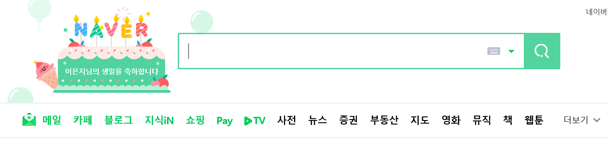

200717

MARKDOWN

마크다운은 일반 텍스트 기반의 경량 마크업 언어다. 일반 텍스트로 서식이 있는 문서를 작성하는 데 사용함

> '>' 인용문 - 인용문 안에 인용문 중첩 가능

* '*'
  - '-'

1. 

   inline 인라인 블록으로 처리시 백틱으로 감싸기 `이렇게`

수평선은 --- *** ___

---

***

___

링크 삽입

[]에 링크 설명, ()에 링크 주소 

ex. [내 github으로](https://github.com/EunjiYi)

글씨체

이텔릭체 *언더바나 아스타리스크로 감싼다.*

보드체 **아스타리스크2개나 언더바2개로 감싼다.**

취소선은 ~~물결표시2개로 감싼다.~~

체크박스 만들기

*나 -나 +뒤에 띄어쓰기 한 번하고 대괄호 쓰기. 대괄호 안에 띄어쓰기를 한다. 

+ [ ] 매일매일 노트필기
  - [대괄호 안에 x를 넣으면 체크된 박스가 생김]
  - - [x] 이렇게요.

이미지 삽입하기

이미지가 word처럼 파일 내부에 저장되는 형태가 아니고, 이미지주소를 이용한다.

느낌표대괄호그냥괄호를 순서대로 작성 후 괄호()안에 이미지주소를 입력하고,

[]안에는 이미지 파일의 이름을 작성한다. 

이미지 주소는 web / local 다 가능한데, 로컬에 이미지파일을 저장한 경우 절대경로가 아닌 상대경로를 사용하여 이미지를 저장한다. 

+

만약 이미지에 링크 걸고 싶으면, 이렇게 하자.

``

표 만들기

파이프 `|`사이에 컬럼을 작성하고 enter를 입력한다. 마지막 컬럼을 작성하면 뒤에 파이프를 다시 붙여준다.

| 가나다 | 123  | abc  | ㄱㄴㄷ |
| ------ | ---- | ---- | ------ |
|        |      |      |        |

`|가나다|123|abc|ㄱㄴㄷ|`

