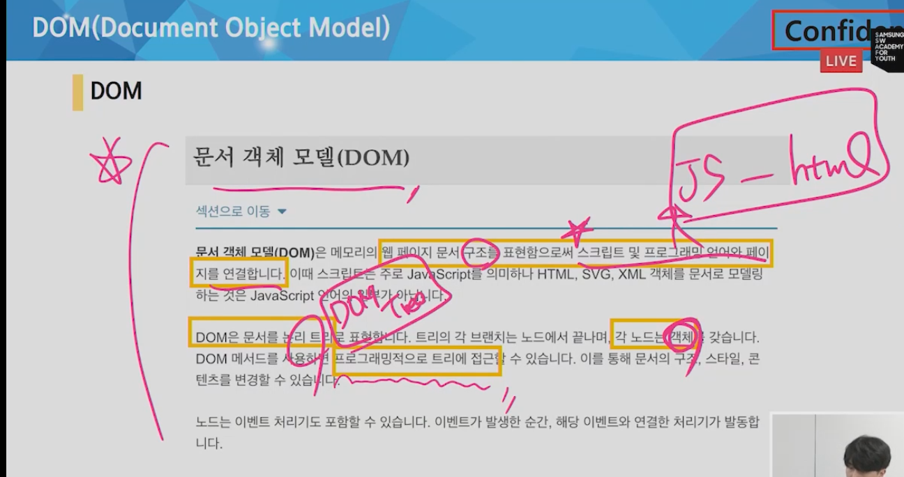

review: API Server를 RESTful 하게

API Server

* Request & Response 요청에 응답
* 데이터 응답(JSON) - html아님

DRF(Django REST Framework)

* API Server 개발을 위한 프레임워크

RESTful

* 자원(URI)
  * 자원을 표현하는데 집중하자.
  * 계층 구조
* 행위(HTTP Method)
  * 행위는 HTTP Method를 통해서 하자.
  * GET/POST/PUT/PATCH/DELETE
* 표현(Representations)
  * Data, Metadata of data
  * 응답데이터(json)

JSON(JavaScript Object Notaion)

* JavaScript의 자료구조 중 하나인 object의 표기법을 따른 데이터교환 포맷

* key와 value의 조합 {'key':'value'}

* 데이터를 교환할 때 사용하는 양식(약속)

#### 단순 문자열 -> 개발환경에 맞는 자료형으로 변환 후 활용

---------

자바스크립트?

브라우저의 문서(도큐멘테이션)을 조작할 수 있는 언어

왜 자바스크립트를 쓰나? = `브라우저 화면을 동적으로 만들기 위해서`

#### JS의 역사

* 회사가 많아서 파편화가 되었다.
* 이제 점점 표준화시키면서 안정되고 있다.

### 결론

브라우저 전쟁, 파편화 & 표준화의 투쟁

브라우저 전쟁의 여파

	> Cross Browsing Issue
	>
	> 표준화(통합)을 위한 노력 (ex. JQurey와 같이 다양한 브라우저에 호환되는 라이브러리)
	>
	> ES6(2015)부터 Vanilla JavaScript

#### Vanilla JavaScript

크로스 브라우징, 간편한 활용 등을 위해 많은 라이브러리 등장(대표적으로 jQuery)

그 후 최근 표준화된 브라우저, ES6 이후의 다양한 도구의 등장으로 순수 자바스크립트 활용이 증대했다!

-------------

### 브라우저에서 할 수 있는 일

DOM 조작(Document Ojects Model)

* 문서(HTML) 조작
* 문서에 node가 존재하고, node 안에서 속성과 메소드가 존재한다.
* html의 마크업을 건들지 않으면서!

BOM 조작(Browser Objects Model)

* navigator, screen, location, frmes, history, XHR

* 주소/링크 등 보여줌

  > location.host
  >
  > location.pathname
  >
  > location.href

* 브라우저 오브젝트를 조작하는 것

  

JavaScript Core(ECMAScript) -- 프로그래밍 언어. 조건/반복/함수

* Data Structure(Object, Array), Conditional Expression, Iteration

---------

### DOM 조작 / 객체를 조작하는 것. 그 객체의 속성과 메소드를 조작하는 것

* 화면으로 표시된 HTML을 조작 가능
* 프로그래밍 적으로 문서에 접근이 가능하구나.

* selector를 이용해서 조작을 한다.

  * `querySelector`를 이요해서 id, class 태그를 선택해서 조작할 수 있다.
  * `getElementId`는 지금 당장은 사용하지 않을 예정
    * live 속성 때문.

* 정리 - 다 차려진 밥상에 반찬추가변경

  1. 선택한다. -1번 접시를 선택한다. 

  2.  변경한다. - 거기에 다른 반찬을 담는다.

     원하는 접시가 없으면 새 접시에 원하는 반찬 담아서 밥상위에 놓는다.

HTML, XML 등과 같은 문서를 다루기 위한 언어 독립적인 문서 모델 인터페이스

(인터페이스란 문서에 있는 어떤 것에 접근해서 무언가를 할 수 있다.)

문서구조, 스타일, 내용 등을 변경할 수 있도록 도우며, 구조화된 노드와 오브젝트로 문서를 표현

주요객체

* window: DOM을 표현하는 창, 가장 최상위 객체, 모든 객체의 부모 객체
* document: 페이지 콘텐츠의 Entry Point 역할을 하며, < body>등과 같은 수많은 다른 요소들을 포함
* navigator, location, history, screen

브라우저마다 각자의 방법으로 DOM을 구현

모든 문서의 노드들은 DOM Tree라고 불리는 트리 구조의 모습을 나타낸다.

브라우저 사이에 DOM 구현이 호환되지 않음에 따라, W3C에서 DOM 표준 구격을 작성

DOM은 문서의 기반이 되는 데이터 구조에 제한을 두지 않지만, 잘 구조화된 문서는 DOM을 사용해 트리 구조를 얻어낼 수 있다. (마크업의 중요성- SEO(Serach Engine Optimization)과도 연관됨.)

스크립트를 작성할 때 문서조작을 위해 document 혹은 window 객체를 사용할 수 있다. `window 객체는 생략가능`

#### selection

#### 단일 Node

document.getElementById(id)

document.querySelector(selector)

> selector: id, class, 복합선택자, tag 선택자 등

#### 여러개

#### HTMLCollection(live)

document.getElementsByTagName(tagName)

> tagName : div, li 등

document.getElementsByClassName(class)

#### NodeList(non-live)

document.querySelectorAll(selector)

선택하고 조작한다.

> 조작 2가지
>
>  -> 선택한 것 내부에 접근해서 그 부분을 바꾸는 등 조작을 한다.
>
> -> 아니면 요소를 새롭게 만들어서,선택한 걸 붙인다.

Manipulation 1 -> 선택한 것 내부에 접근해서 그 부분을 바꾸는 등 조작을 한다.

* innerText

  > 텍스트 ex.`<h1>안녕하세요</h1>`

* innerHTML -> html요소를 바로 넣는 것.

  > XSS 공격에 취약점이 있으므로 사용시 주의 
  >
  > ex. `안녕하세요.`
  >
  > 그래서 이 안에 실행 스크립트를 넣으면 진짜로 그것이 실행되서 취약하디고 하는 것.

Niode attribute

* element.sytle.backgroundColor

* setAttribut(attributeName, value)

  > `li3.setAttribute('id', 'king')` 
  >
  > king이라는 이름의 id로 style 이 있을 때 이것을 li3에 적용시킴.

* getAttribute(attributeName)

  > const.getAttr = li1.getAttribute('style')  --- li1에 적용된 속성을 getAttr이라는 변수에 담아라.
  >
  > console.log(getAttr) --- 개발자도구 콘솔에서 나온다.

Manipulation 2 -> 요소를 새롭게 만들어서,선택한 걸 붙인다.

* Document.createElement(tagName) - 특정 태그를 생성 ex. h1 태그

* ParentNode.appendChild(Node) - 마지막 자식 요소로 추가 / append

  > appendChild는 괄호안에 노드 딱 하나만 들어간다. 여러개 넣어도 맨 앞에 있는 거 하나만 들어감.
  >
  > append는 여러개 가능
  >
  > 이것 외에 2개 차이 더 있어서 총 3가지 차이인데, 자세한건 공식문서 참고.

* ParentNode.removeChild(child Node) - 해당 요소를 제거 / remove

  > remove는 안에 인자없이 
  >
  > ul.remove()하면 ul태그 밑에있는 걸 싹다 날린다.
  >
  > 그래서 body.remove()하면 다 날라감

### DOM(Document Object Model) 정리

1. 선택한다.

   > querySelector()
   >
   > querySelectorAll()

2. 변경한다.

   > 2-1. 속성들의 값들을 변경하는 작업
   >
   > innerText
   >
   > innerHTML
   >
   > setAttribute()
   >
   > getAttribute()
   >
   > element.style.color
   >
   > 2-2. 아예 새로운 엘리먼트를 만들어서 기존꺼에 붙이는 방법
   >
   > createElement()
   >
   > appendChild()

html문서에 `</body> `바로 위에 ``만들기

로딩 문제라서 이 위치인 것도 있다.

js가 로딩이 좀 걸리는데, 만약 바디태그 윗부분에 위치하면 페이지에 아무것도 안보이는 상태에서 몇 초를 기다려야할수도...!

#### classList와 className

navTag.classList -> 리스트로 나옴.

navTag.className -> 문자열로 나옴.

-------------

### EventListner

* 이벤트

  * 브라우저에서 일어나는 일

* 이벤트 리스너

  * `~하면 ~한다.`

  * 특정한 이벤트가 발생하면, 할 일을 실행한다.

    `이벤트타겟.addEventListener(이벤트타입, 할 일)`

* preventDefault()

  * 기존에 발생하는 동작을 동작하지 않게 설정. (ex. submit)

    