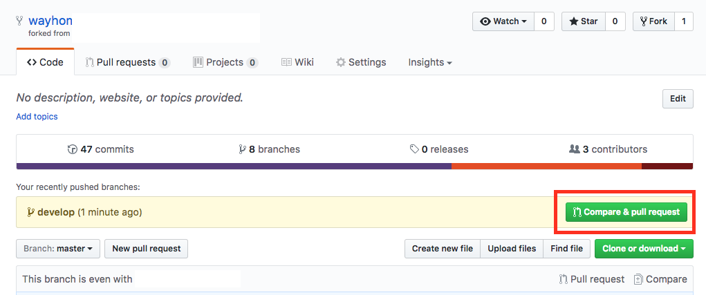

구글링 gitlab flow

https://docs.gitlab.com/ee/topics/gitlab_flow.html

구글링 github flow

https://guides.github.com/introduction/flow/

----------

**“회사 기술블로그 repository를 포크떠서 후기 작성하시고 저한테 PR 보내주세요”**

Fork

clone, remote설정

branch 생성

수정 작업 후 add, commit, push

Pull Request 생성

코드리뷰, Merge Pull Reqest

Merge 이후 branch 삭제 및 동기화

**1. Fork**

타겟 프로젝트의 저장소를 자신의 저장소로 Fork 한다.

**2. clone, remote 설정**

fork로 생성한 본인 계정의 저장소에서 **clone or download** 버튼을 누르고 표시되는 url을 복사한다. (중요 - 브라우저 url을 그냥 복사하면 안 된다)

터미널을 켠다. 

자신의 컴퓨터에서 작업을 하기 위해서 Fork한 저장소를 로컬에 clone 한다.

$ git clone https://github.com/wayhome25/blog.github.io.git

로컬 저장소에 원격 저장소를 추가한다. 위 작업과 동일하게 github 저장소에서 **clone or download** 메뉴를 통해서 확인한 url을 사용한다.

원본 프로젝트 저장소 (직접 추가 필요)

fork한 로컬 프로젝트 (origin이라는 별명으로 기본으로 추가되어 있다. 따로 추가할 필요 없음)

*# 원본 프로젝트 저장소를 원격 저장소로 추가* $ git remote add real**-**blog(별명) https:**//**github**.**com**/**원본계정**/**blog**.**github**.**io**.**git *# 원격 저장소 설정 현황 확인방법* $ git remote **-**v

**3. branch 생성**

자신의 로컬 컴퓨터에서 코드를 추가하는 작업은 branch를 만들어서 진행한다.

> *개발을 하다 보면 코드를 여러 개로 복사해야 하는 일이 자주 생긴다. 코드를 통째로 복사하고 나서 원래 코드와는 상관없이 독립적으로 개발을 진행할 수 있는데, 이렇게 독립적으로 개발하는 것이 브랜치다. - pro git book*

*# develop 이라는 이름의 branch를 생성한다.* $ git checkout -b develop Switched to a new branch 'develop' *# 이제 2개의 브랜치가 존재한다.* $ git branch ***** develop master 

**4. 수정 작업 후 add, commit, push**

자신이 사용하는 코드 편집 툴을 활용하여 수정 작업을 진행한다.

작업이 완료되면, add, commit, push를 통해서 자신의 github repository (origin)에 수정사항을 반영한다.

주의사항 push 진행시에 branch 이름을 명시해주어야 한다.

*# develop 브랜치의 수정 내역을 origin 으로 푸시한다.* $ git push origin develop

**5. Pull Request 생성**

push 완료 후 본인 계정의 github 저장소에 들어오면 **Compare & pull reqeust** 버튼이 활성화 되어 있다.

해당 버튼을 선택하여 메시지를 작성하고 PR을 생성한다.

**6. 코드리뷰, Merge Pull Reqest**

PR을 받은 원본 저장소 관리자는 코드 변경내역을 확인하고 Merge 여부를 결정한다.

**7. Merge 이후 동기화 및 branch 삭제**

원본 저장소에 Merge가 완료되면 로컬 코드와 원본 저장소의 코드를 동기화 한다.

작업하던 로컬의 branch를 삭제한다.

*# 코드 동기화* $ git pull real**-**blog(remote 별명) *# 브랜치 삭제* $ git branch **-**d develop(브랜치 별명)

나중에 추가로 작업할 일이 있으면 git pull real-blog(remote 별명) 명령을 통해 원본 저장소와 동기화를 진행하고 3~7을 반복한다.

