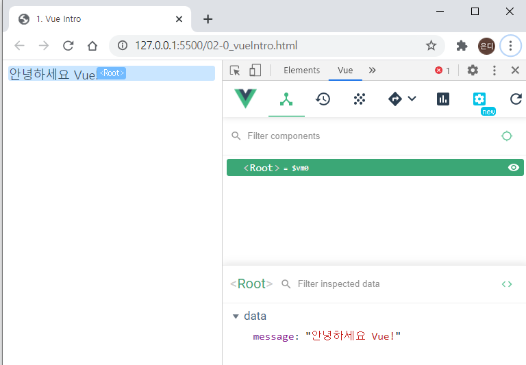
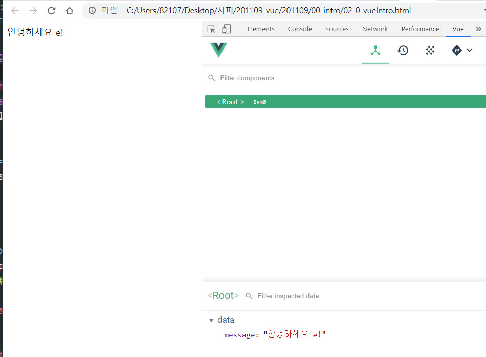

https://kr.vuejs.org/v2/guide/index.html


Vue는 ECMAScript 5 기능을 사용하기 때문에 IE8 이하 버전을 **지원하지 않습니다.** 하지만 모든 [ECMAScript 5 호환 브라우저](https://caniuse.com/#feat=es5)를 지원합니다


## [Vue Devtools](https://kr.vuejs.org/v2/guide/installation.html#Vue-Devtools)

Vue를 사용할 때, 브라우저에 [Vue Devtools](https://github.com/vuejs/vue-devtools#vue-devtools)를 설치 하는것이 좋습니다. Vue 앱을 보다 사용자 친화적인 인터페이스에서 검사하고 디버깅할 수 있습니다.

## [직접 ``에 추가](https://kr.vuejs.org/v2/guide/installation.html#직접-lt-script-gt-에-추가)

다운로드 받아 script 태그에 추가하기만 하면 됩니다. `Vue`는 전역 변수로 등록됩니다.


### [CDN](https://kr.vuejs.org/v2/guide/installation.html#CDN)

프로토 타이핑또는 학습 목적이라면, 아래 코드로 최신 버전을 사용할 수 있습니다.

```
<script src="https://cdn.jsdelivr.net/npm/vue/dist/vue.js"></script>
```

프로덕션 환경인 경우 새 버전에서 예상치 못한 오류를 방지하려면 특정 버전의 빌드 파일을 추가하는것을 추천합니다. -> 이건 배포용이라서 debug이 안되기 때문에 devtools사용이 불가능하다.

```
<script src="https://cdn.jsdelivr.net/npm/vue@2.6.0"></script>
```


## [선언적 렌더링](https://kr.vuejs.org/v2/guide/index.html#선언적-렌더링)

Vue.js의 핵심에는 간단한 템플릿 구문을 사용하여 DOM에서 데이터를 선언적으로 렌더링 할 수있는 시스템이 있습니다.


```html
<div id="app">
  {{ message }}
</div>
```


```javascript
var app = new Vue({
  el: '#app',
  data: {
    message: '안녕하세요 Vue!'
  }
})
```





만약 이 화면이 안 뜬다면,

확장프로그램 설치 후 세부정보들어가서 `파일 URL에 대한 액세스 허용`을 해주자.


메세지 내용을 수정할 때마다 어떠한 새로고침없이 자동으로 바뀌기 때문에 `반응형`이라고 한다. `reactive` 

JS는 선택해서 변경했다면, vue는 데이터를 변경해주면 DOM도 알아서 변경이 된다. 




```html
<div id="app-4">
  <ol>
    <li v-for="todo in todos">
      {{ todo.text }}
    </li>
  </ol>
</div>
```

 `v-`로 시작하는 것은 vue의 directive라고 부른다.


데이터가 바뀌면  DOM이 바뀐다. = rerendering


v-bind

1) html 표준 속성에 연결할 때 쓴다.

2) 클래스 바인딩할 때 쓴다.