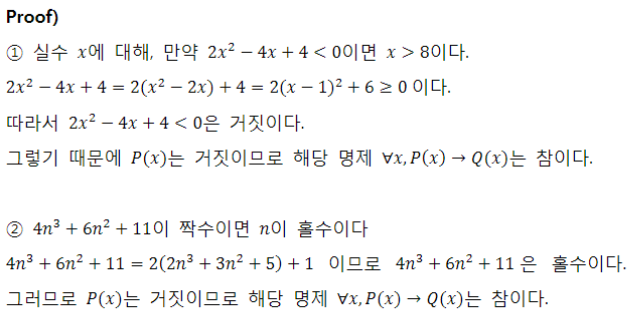

## 프로그래밍과 논리/수학

#### 서문 - 어떤 전공도 상식선에서 이해되는 분야는 없다.

토플과 복권-

“합격하려면 토플500점이상 혹은 토익600점 이상이 필요” vs. “복권에 당첨되면 자동차 혹은 천만원을 줍니다”-

두 말은 같은 표현을 사용하지만 하나는 inclusive or, 다른 하나는 exclusive or


일상생활에서는

-Soft Logic이 빠르기 때문 에유용

-논리적으로 부정확한 표현을 사용하지만, 어떤 의미인지 모든 사람이 이미 알고 있다는 가정이 존재


프로그래밍은 Hard Logic을 사용

-프로그래밍 언어의 표현들이 모두 논리학에서 나온것

-사용되는 수많은 알고리즘들을 이해하기 위해서는 Hard Logic이 필요


#### 명제 : 참이나 거짓을 알 수 있는 식이나 문장.

> p, q, r ... 로 표현
>
> ex. 서울은 대한민국의 수도다. -> 참
>
> ex. 1+1=3 -> 거짓

진릿값: 참이나 거짓을 표현. T/F 또는 1,0


#### 연산[결합]

* 부정 NOT

  > p가 명제일 때, 명제의 진릿값이 반대
  >
  > ~p로 표기 (`not p` 또는 `p의 부정` 이라 읽는다.)


* 논리곱 AND

  > p, q가 명제일 때, p,q 모두 참일 때만 참이 되는 명제
  >
  > p ^ q (`p and q`, `p 그리고 q`라고 읽는다.)
  >
  > **p ^ q의 결과는, p도 true 이고 q도 true 일 때만 true 다**.


* 논리합 OR

  > p, q가 명제일 때, p, q 모두 거짓일 때만 거짓이 되는 명제
  >
  > `p v q` (`p or q`, `p 또는 q`라고 읽는다.)
  >
  > **p v q의 결과는, p도 false이고 q도 false 일 때만 false다.**


* 배타적 논리합 XOR

  > p. q가 명제일 때, p, q 중 하나만 참일 때 참이 되는 명제
  >
  > `p xor q`
  >
  > **exclusive or는 두 개의 진리값이 서로 다를 때 =  하나만 참일 때 참**


[합성]

#### 연산자 우선순위

`~(not)` > `v(or)`, `^(and)` > `->(조건명제)` ,`<->(쌍방조건명제)`

항진명제: 진릿값이 항상 참

모순명제: 진릿값이 항상 거짓

사건명제: 항진명제도 모순명제도 아닌 명제


##### 조건명제: 

p, q가 명제일 때, 명제 p가 조건(또는 원인), q가 결론(또는 결과)로 제시되는 명제.

 `p->q` `p이면 q이다.`

| p    | q    | p->q         |
| ---- | ---- | ------------ |
| T    | T    | T            |
| T    | F    | F            |
| F    | T    | **T (주의)** |
| F    | F    | **T (주의)** |

ex. `100점을 받으면 치킨을 사준다.` (약속을 지켰다 = 참)

100점을 받는다는 전제가 있어야 명제의 참/거짓을 판단하는 것이 의미가 있다.

그러므로 100점을 못받으면 **(p가 F이면) 그 뒤의 q가 참이던 거짓이던 간에 해당 명제는 무조건 참이다.**


#### 쌍방조건명제: 

p, q가 명제일 때, 명제 p와 q가 모두 조건이면서 결론인 명제. `p<->q` `p면 q고, q면 p다.`

| p    | q    | p<->q                                  |
| ---- | ---- | -------------------------------------- |
| T    | T    | T                                      |
| T    | F    | F                                      |
| F    | T    | F (조건명제와 비교했을 때 이것만 다름) |
| F    | F    | T                                      |

`만약  쌍방조건명제에서 p<->q가 F라면, 적어도 p와 q는 다른 진리값을 가진다. `는 것을 알 수 있다. 


#### 조건명제의 역, 이, 대우

> 조건명제: `p -> q`
>
> 역: `q -> p`
>
> 이: `~p -> ~q`
>
> 대우: `~q -> ~p`

| p    | q    | p->q | q->p | ~p->~q | ~q->~p |
| ---- | ---- | ---- | ---- | ------ | ------ |
| T    | T    | T    | T    | T      | T      |
| T    | F    | F    | T    | T      | F      |
| F    | T    | T    | F    | F      | T      |
| F    | F    | T    | T    | T      | T      |


### 논리연습

참/거짓 판단 


#### 문제1

* 만약 0이 홀수라면, 미국에서 2080년 월드컵이 열린다. (조건명제 p->q)

  > 0이 홀수가 아니므로 p가 거짓. q의 참거짓 여부와 상관없이 해당 명제는 참.

* 만약 19893827938274839이 Prime Number라면 2는 짝수다. (조건명제 p->q)

  > p의 참/거짓을 판별하기 어려우므로 대우를 증명하자.
  >
  > 2가 홀수라면 19893827938274839는 Prime Number가 아니다. 
  >
  > 2가 홀수가 아니므로 p가 거짓, 즉 대우가 참이다.
  >
  > 대우가 참이므로 해당 명제는 참이다. 


#### 문제2

* p와 q가 명제이고, p->q가 거짓이라고 할 때, 다음 명제식의 참거짓은?

  * `~p -> q`

    > p->q가 거짓인 상황은 p가 참, q가 거짓일 때만.
    >
    > 즉 ~p -> q는 F ->  F니까 참.

  * `p v q`

    > 둘 중 하나만 true면 true인데, 현재 p가 true니까 참.

  * `q -> p`

    > q가 거짓이므로 전체 명제는 참.


#### 문제3

다음 명제들의 역, 이, 대우를 쓰시오

1. 만약 0이 홀수라면, 미국에서 2080년 월드컵이 열린다. 

   > ①명제: 만약0이 홀수라면, 미국에서 2080년 월드컵이 열린다.
   >
   > 역: 만약 미국에서 2080년 월드컵이 열린다면, 0이 홀수이다.
   >
   > 이: 만약 0이 짝수라면, 미국에서 2080년 월드컵이 열리지 않는다.
   >
   > 대우: 만약 미국에서 2080년 월드컵이 열리지 않는다면, 0은 짝수이다.

   

2. 만약 19893827938274839이 Prime Number라면 2는 짝수다. 

   > ②명제: 만약 19893827938274839이 Prime Number라면, 2는 짝수이다.
   >
   > 역: 만약 2가 짝수이면 19893827938274839이 Prime Number 이다.
   >
   > 이: 만약 19893827938274839이 Prime Number가 아니라면 2는 홀수이다.
   >
   > 대우: 만약 2가 홀수이면 19893827938274839이 Prime Number가 아니다.


#### 문제4

다음 명제식의 진리표를 만드시오.

1. `p^(q->~p)`


2. `(p^~q)->r`


답지


### 증명

증명은 정확한 명제식으로 표현할 수 있는 것이어야 한다. (보통 정확한 명제식까지 쓰지는 않으나 근본적으로 명제식으로 바꿀 수 있음)

증명한 대한 수많은 오해가 p->q와 q->p를 혼동하는 것에서부터 일어난다. (논리적으로 완전히 다른 건데, 반대방향으로 같다고 생각하면 아주 큰 일! )


#### Q1. 모든 당구공은 색이 같다는 다음 증명에서 잘못된 것은? 

> **수학적귀납법 **
>
> P(1)이 참이고, P(n)→P(n+1)이 참이면 P(n)은 모든 자연수 n에 대해서 참이다.
>
> 모든 자연수 n에 대해 당구공 n개가 들어있는 집합에서 그 집합에 포함된 당구공은 모두 색이 같다는것을 증명함
>
> P(1): 당구공 1개가 들어 있는 집합은 모두 색이 같음
>
> P(n)→P(n+1)을 증명하기 위해  P(n)이 참이라고 가정
>
> 당구공 n+1개가 들어있는 임의의 집합을 생각함
>
> 이 집합에서 하나를 빼면 당구공 n개가 있는 집합이 되므로 지금 상황에서 모든 당구공의 색이 같음
>
> 방금 뺀 원소를 다시 넣고, 다른 당구공을 빼면 역시 당구공 n개가 있는 집합이 되므로 지금 상황에서도 모든 당구공의 색이 같음
>
> 위의 두 상황에서 처음 뺀 당구공과 두번째로 뺀 당구공의 색이 같음을 알 수 있으므로 당구공 n+1개가 들어있는 임의의 집합은 색이 같은 것만을 포함함


대부분의 사람들이 P(n)이 참이라고 가정할 수 없다고 반론하는데, 수학적 귀납법에서 필요한 것은 `P(n)→P(n+1)`이 참임을 보이는 것 뿐이므로 **P(n) 자체가 참일 필요는 없음**


#### A1. 위 증명에서 실제로 잘못된 부분

*위의 두 상황에서 처음 뺀 당구공과 두 번째로 뺀 당구공의 색이 같음을 알 수 있으므로...*

처음 뺀 당구공과 두 번째로 뺀 당구공의 색이 같다는것은 공통부분이 있다는 것인데, 실제로 n=1인경우, 즉 n+1=2인 경우 공통부분이 없음

> 2개가 들어있는데 하나는 빨간색이고 하나는 파란색이라서, 
>
> 빨간색을 뺐을 때 남아있는 공이 전부 파란색이라 색이 같다고 말하고 
>
> 빨간색을 다시 넣고 파란색을 뺐을 때 남아있는 공이 전부 빨간색이라서 색이 같다고 말하는 경우가 있다.
>
> 즉, 두 공의 색 빨간색 != 파란색


#### Q2. Prime Number의 개수는 무한히 많다는 다음 증명은 옳은가?

> Prime Number의 개수가 유한한 k개라고 가정
>
> 모든 Prime Number를 다 곱하고 1을 더한 수를 n이라고 하자-
>
> 이 수 n은 어떤 Prime Number으로 나누어도 나머지가 1이다. = 어떤 Prime Number으로도 나누어 떨어지지 않음.
>
> 그런데 n은 어떤 Prime Number보다도 크므로 합성수이다. = 소수가 유한하다고 했고 n은 그 소수들을 다 곱한것에 1을 더한 값이니까 n은 합성수일 수 밖에 없다. 합성수는 어떤 수로 나누어 떨어지는 수
>
> 합성수이지만 어떤 Prime Number으로도 나누어지지 않으므로 모순 발생


#### A2. yes

이 증명에 대한 반론으로 몇 개의 Prime이 더 존재하면 되는 것이 아니냐는 주장이 자주 있는데, 

위 증명은 `Prime Number가 k개이면 모순이 발생`, 즉, `Prime Number가 k개→항상거짓`, 이 명제가 항상 참임을 확인한 것

즉, `Prime Number가 k개라는 명제가 항상 거짓`일 수 밖에 없다!


----------


###  수학적 귀납법과 증명의 수준

* 수학적 귀납법의 기본형: P(1)이 참이고, P(n)→P(n+1)이 참이면 P(n)은 모든 자연수 n에 대해서 참이다.

- 수학적 귀납법의 강한 형태: P(1)이 참이고, P(1)∧P(2)∧⋯∧P(n)→P(n+1)이 참이면 P(n)은 모든 자연수 n에 대해서 참이다.

> 사실 이런 것들은 아주 어려운 문제를 다룰 때, 본인의 접근법/조건 등이 맞는가를 확인을 하기 위해 필요한 과정이다. ex. 알고리즘에 대한 논문 쓰기


#### 다음 함수가 1부터 x까지의 합을 계산함을 증명해보자 

```c++
int sum(int x)
{
    if (x <= 0) return 0;
    return x + sum(x-1);
}
```


- High-level 증명에서는1부터 x까지 합의 정의 중 하나인 `S(n)=S(n−1)+n`을 그대로 코딩한 것이므로 증명이 된 것이라고 말하는 경우가 많음

- 상세한 증명을 하려면 단순히 “답이 맞는 것이 당연하다”라고 말하는 것으로는 충분하지 않고 **증명이 가능한 명제를 만들어야 한다** 

- 이 경우 증명이 가능한 명제는 다음과 같다.

  > `sum(x)가 리턴하는 값은 1+2+...+x의 값과 항상 같다`

- 이제 **수학적 귀납법**을 적용할 수 있다. 

  > `P(1)이 참이다: “sum(1)이 리턴하는 값이 1이다”` 를 증명하면 됨. 
  >
  > 실제 코드에 1을 대입하면 1을 리턴함을 알수 있다.
  >
  > 이제 `P(x)→P(x+1)이 참이다: “sum(x-1)이 1+2+...+(x-1)을 리턴하면 sum(x)는 1+2+...+x를 리턴한다”`를 증명하자. 
  >
  > 코드를 보면 sum(x)는 x+sum(x-1)의 값을 리턴한다. sum(x-1)의 리턴값은 1+2+...+(x-1)과 같다고 가정했으므로 sum(x)는 1+2+...+(x-1)+x = 1+2+...+x를 리턴함을 확인할 수 있다.
  >
  > sum(x-1)을 블랙박스로 보는 것이 이해에 도움을 줄 때가 있음!


#### 소팅의 사례

* High-level 증명에서는 소팅이 된다는 것을 직관적인 수준에서 설명하는 경우가 많다.
* 그러나 상세한 증명을 위해서는 증명이 가능한 명제가 필요하다.
* `배열 A[1], A[2], ..., A[n]을 소팅하는 알고리즘의 정확성을 증명`하려고 한다면, 증명이 가능한 명제는 다음과 같다: `A[1] < A[2] < ...< A[n]`
* 버블소트가 정확함을 어떻게 증명할지 고민 한 번 해보기.


---------------

### 증명 연습

상세한 증명에 대한 경험이 없는 경우가 많고, 상세한 증명 없이는 확인하거나 이해할 수 없는 문제들이 많으므로 연습 문제들은 상세한 증명을 제시하는 것을 목표로 한다.


### 1. Trivial Proof: ∀x(모든 x에 대해서), P(x)→Q(x)를 증명하려는데, Q(x)가 항상 참인 경우

#### 문제

다음 명제를 증명하시오.


### 2. Vacuous Proof: ∀x(모든 x에 대해서), P(x)→Q(x)를 증명하려는데, P(x)가 항상 거짓인 경우

#### 문제

다음 명제를 증명하시오.




