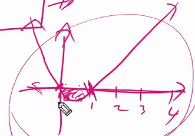
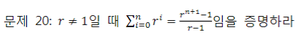

## 논리와 증명 


#### 문제1: 다음 명제들이 항진명제라는 것을 진리표를 이용해서 보이시오.

1. `~(~p ^ q) v q`


2. `(~p v q) v (p ^ ~q)`


#### 문제2: 다음 명제들이 모순명제라는 것을 진리표를 이용해서 보이시오.

1. `(~p v q) ^ (p ^ ~q)`


2. `(p ^ q) ^ (p ^ ~q)`


#### 문제3: 다음 명제의 쌍들에 대해서 두 명제가 동등한지를 진리표를 이용해 확인하시오

1. `p ^ (p v q)`와 `p` -> 두 명제는 동등하다.


2. `~p v ~q`와 `~(p v q)` -> 두 명제는 다르다.

   

   


#### 문제4: 명제식의 변형을 통하여 다음 명제를 간소화 하시오

① `(p ∧ ~q) ∨ (p ∧ q)`  

	>이렇게 묶을 수 있다. (결합법칙)
	>
	>`p ^ (~q V q)` 
	>
	>`(~q V q)` 는 항상 True.
	>
	>즉 `p ^ U(항진명제=항상 T)` = `p` 
	>
	>답 `p`

②` ( p ∨ ~q) ∧ (~p ∨ ~q)`

> (p ^ ~p) V ~ q
>
> (p ^ ~p) 는 `φ` (공집합 파이)
>
> `φ v ~q` = `~q`
>
> 답 `~q`


#### 문제5: 다음 명제들이 참인지 확인하시오. 단, R은 실수의 집합을 의미하고, Z는 정수의 집합을 의미한다.

①`∀x(모든 x) ∈ R, x2 ≥ x` -> `모든 x에 대하여` 라고 했으므로 반례를 들면 된다. x = 0.5 `거짓`

②`∀x ∈ Z, x2 ≥ x` -> `참`

> x^2 -x ≥ 0 
>
> x(x-1) ≥ 0

③`∃x(어떤 x) ∈ R, x2 < x` -> `어떤/임의의 x에 대하여` 라고 했으므로 만족하는 것 하나만 있어도 된다. x = 0.5 `참`

④`∃x ∈ Z, x2 < x` -> 모든 정수 x에 대해서 다 `x^2 ≥ x` 이기(②) 때문에 없다. `거짓`

> x^2 -x < 0 
>
> x(x-1) < 0
>
> 이것이 만족하려면, 0 < x < 1 이어야 한다. 그러나 이런 정수(Z)는 없다. 




#### 문제6: (직접증명) n이 짝수이면 3n+5는 홀수임을 증명하라.

(힌트: n=2k로 두고 3n+5가 2(어떤정수)+1 형태로 표현될 수 있는지 보자.)

> 6k + 5 = `2(3k+2) +1`


#### 문제7: n이 홀수이면 n2+n은 짝수 임을 증명하라.

> n = 2k + 1
>
> = (2k + 1)^2 + 2k + 1
>
> = 4k^2 + 4k + 1 + 2k + 1
>
> = 4k^2 + 6k + 2
>
> =2(2k^2 + 3k + 1)


#### 문제8: m이 짝수이고 n이 홀수이면 2m+3n은 홀수임을 증명하라

> m = 2k
>
> n = 2l + 1
>
> 2m + 3n = 2(2k) + 3(2l + 1)
>
> = 4k + 6l + 3
>
> = 2(2k + 3l + 1) + 1


#### 문제9: (대우를 증명) 자연수 n에 대해, n2+5가 홀수이면 n은 짝수임을 증명하라

(힌트: 명제 대신 대우를 증명한다. n이 홀수이면 n2+5은 짝수임을 증명한다)

> n = 2k + 1
>
> n^2 + 5 =(2k+1)^2 + 5 = 4k^2 + 4k + 1 + 5 = 2(2k^2 + 2k + 3)


#### 문제10: n2이 짝수이면 n은 짝수임을 증명하라.

> 대우를 증명한다. 
>
> n이 홀수이면 n2는 홀수이다.


#### 문제11: (경우를 나누어 증명) 자연수 n에대해 n^2+5n+3은 항상 홀수임을 증명하라.

(힌트: n이 짝수인 경우와 홀수인 경우를 따로 증명한다.)

> n = 2k 일 때,  
>
> n^2 + 5n + 3 = 4k^2 + 10k + 3 = 2(2k^2 + 5k + 1) + 1
>
> n = 2k+1 일 때,
>
> n^2 + 5n + 3 = (2k+1)^2 + 5(2k+1) + 3 = 4k^2 + 4k + 1+ 10k + 5 + 3 = 4k^2 + 14k + 9 = 2(2k^2 + 7k + 4) + 1


#### 문제12: n2이 3의배수이면 n은 3의배수임을 증명하라.

> n이 3의 배수가 아니면, n^2은 3의 배수가 아니다. <= 대우를 증명하자.
>
> n = 3k+1 일 때, 
>
> n^2 = (3k+1)^2 = 9k^2 + 6k + 1 = 3(3k^2 + 2k) + 1
>
> n= 3k+2 일 때,
>
> n^2 = (3k+2)^2 = 9k^2 + 12k + 4 = 3(3k^2 + 4k +1) + 1
>
> 즉, n^2은 3의 배수가 아니다.
>
> 해당 명제의 대우가 참이므로, 해당 명제도 참이다.


#### 문제13: n이 홀수이면 n2을 8로 나눈 나머지는 1임을 증명하라

(힌트: n을 4로 나눈 나머지가 1인 경우와 3인 경우로 나누어보자)

> n = 4k + 1 일 때,
>
> n^2 = (4k+1)^2 = 16k^2 + 8k + 1 = 8(2k^2 + k) + 1 
>
> n = 4k + 3 일 때,
>
> n^2 = (4k + 3)^2 = 16k^2 + 24k + 9 = 8(2k^2 + 3k + 1) + 1


#### 문제14: 어떤 자연수를 제곱하여도그 결과를 3으로 나눈 나머지는 2가 아님을 증명하라.

> 3으로 나눈 나머지를 알아보기 위해서 자연수를 3의 배수로 표현해보자.
>
> n = 3k, 3k+1, 3k+2
>
> n= 3k 일 때,
>
> n^2 = 9k^2 = 3(3k^2)  -> 나머지 0
>
> n= 3k+1 일 때,
>
> n^2 = 9k^2 + 6k +1 = 3(3k^2 + 2k) + 1 -> 나머지 1
>
> n= 3k+2 일 때,
>
> n^2 = 9k^2 + 12k + 4 = 3(3k^2 + 4k + 1) +1 -> 나머지 1


#### 문제15: (귀류법) 유리수와 무리수의 합은 무리수임을 증명하라.

(힌트: 어떤 유리수와 어떤 무리수의 합이 유리수가 된다고 가정하고 모순을 이끌어 낼 수 있는가?)

```
[ Solution ]
Proof)
어떤 유리수와 어떤 무리수의 합이 유리수가 된다고 가정하자. 
유리수a, 무리수b가 있고 a 와 b의 합은 유리수c가 된다고 하자.
a + b = c, b = c –a가 되고, 이때 c –a 값인 b는 유리수의 성질에 의해 유리수여야만 한다.가정에 모순)

따라서 b가 무리수라는 가정에 모순되므로, 유리수와 무리수의 합은 무리수임을 증명할 수 있다.
```


#### 문제16: √2는무리수임을증명하라.

(힌트: 유리수가 된다는 것은 기약분수로 표현이 된다는 것이다)

```
가정: √2기 유리수라고 가정을 하자.
그러면 √2 = b/a (a, b는 서로소)
2 = b^2/a^2
2a^2 = b^2
그러면
b^2이 2의 배수, b는 2의 배수
a^2 = b^2/2 = 2의 배수를 2로 나눈 것이기 때문에 a^2은 2의 배수, a도 2의 배수
둘 다 2의 배수이므로 a, b가 서로소라는 가정이 모순된다.
즉, √2는 무리수다.
```


#### 문제17: log(2)5는 무리수임을 증명하라.

```
가정: log(2)5가 유리수라고 가정을 하자. 
그러면 log(2)5 = b/a (a, b는 서로소)
2 ^ (b/a) = 5
양 변에 a^2 을 하면 2^b = 5^a
이 수식을 만족시킬 수 있는 정수는 없다. 왜냐하면
2를 제곱하면 항상 짝수가 나오고
5를 제곱하면 항상 홀수가 나오기 때문이다. 
a, b가 서로소(정수)라는 가정에 모순.
즉, 가정에 모순되므로 log(2)5는 무리수이다. 
```


#### 문제18: (수학적귀납법) 1+2+3+⋯+n = n(n+1)/2 임을 증명하라.


#### 문제19: 1^2+2^2+3^2+⋯+n^2 = n(n+1)(2n+1)/6임을 증명하라.


#### 문제20: r ≠ 1일때 ∑i=0부터 n까지  r^i = (r^(n+1) - 1) / (r−1)임을증명하라




#### 문제21: 2 이상의 모든 자연수n에 대해 n^3−n은 6으로 나누어 떨어짐을 증명하라.


#### 문제22: 2 이상의 모든자연수 n에 대해 √n < 1√1 + 1√2 + ⋯ + 1√n임을 증명하라.


#### 문제23: n×n 체스판이 있다. 시작 시점에 일부 칸들이 감염되어 있다. 매초마다 감염이 증가할 수 있다. 규칙은 다음과 같다. 어떤 감염되지 않은 칸은 상하나 좌우로 인접한 네개의 칸들중 2개 이상이 감염된 상태일 때 감염된다. 이 규칙에 따라 모든 칸들을 감염시키기 위해서는 초기에 n개 이상의 칸들이 감염되어 있어야 함을 증명하라.

(힌트: 금방 떠오르는 것은 답이 아닐 가능성이 많다.)


