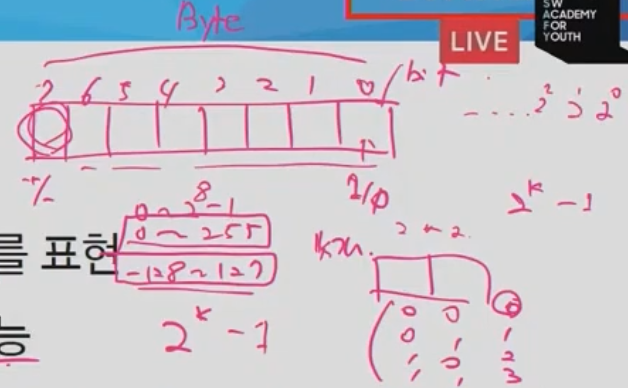
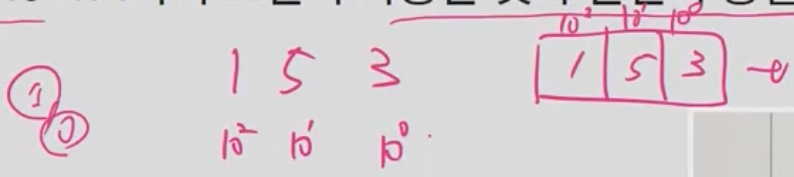
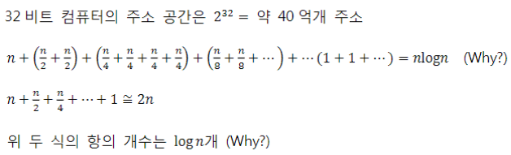
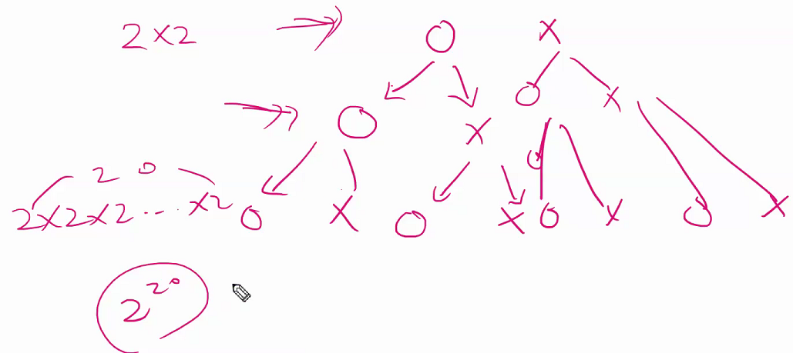
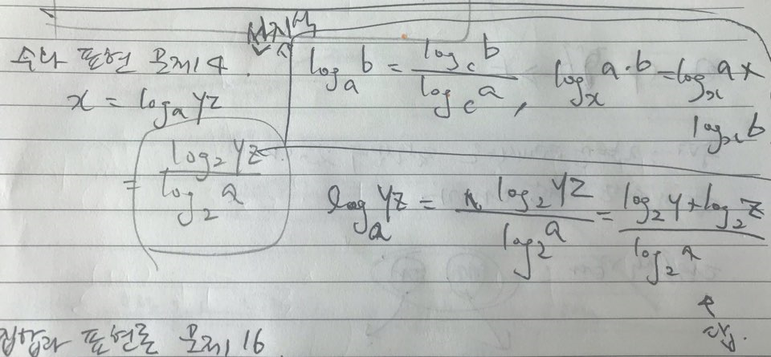
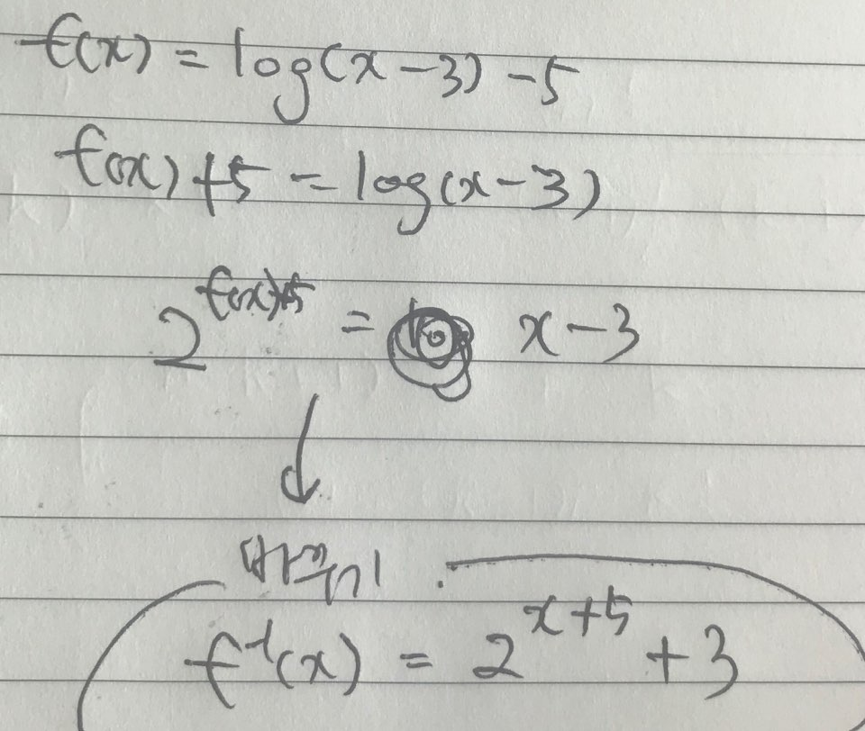
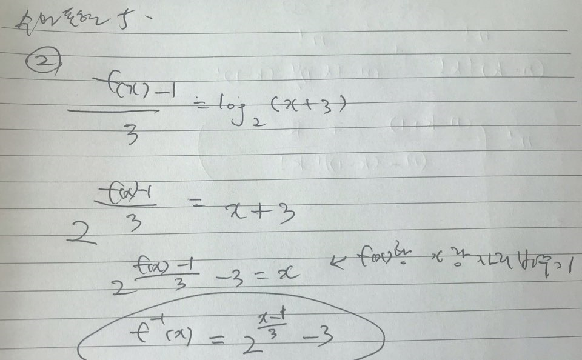
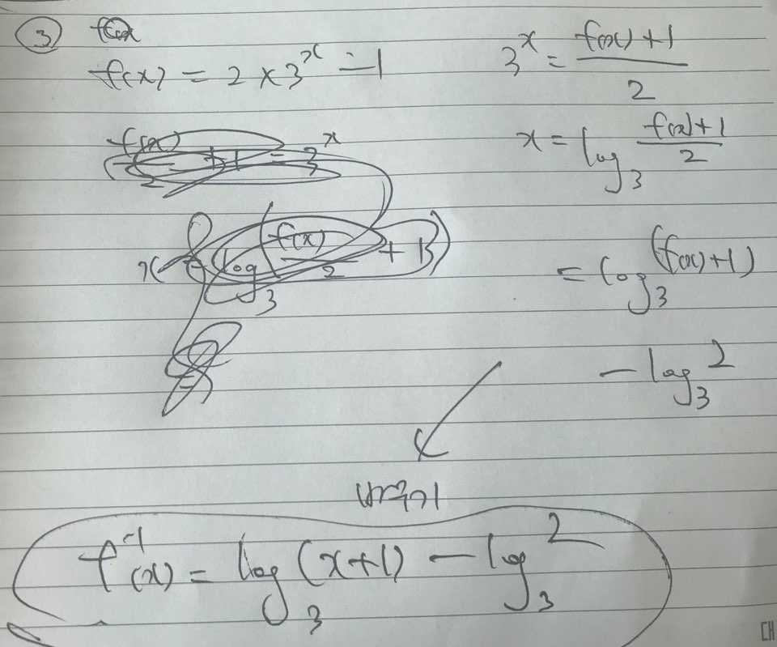

## 수와 표현

#### 약간의 설명

* 컴퓨터는 `0`/`1`을 표현할 수 있는 비트들을 모아 수를 표현항가.

* k개의 비트를 사용하면 `0부터 2^k−1까지` 표현이 가능하다.

* 사실, 꼭 저 범위만 가능한 것은 아니다. 약속하는 방식에 따라 다르지만, 어떤 경우든 최대 `2^k가지의 값`을 표현하는 것이 가능하다. 

>  ex. k=8일 때, `0 ~ 255` 수를 표현할 수 있지만, 
>
>  양수/음수 부호를 주게 되면 똑같이 255개를 표현할 수 있지만 수의 범위는 `-128 ~ 127`이 된다. 
>
>  

* 비트라고 어렵게 생각하지 말자. 10진수로 k자리를 쓰면 `0부터 10^k−1까지 표현이 가능`한 것과 완전히 동일하다.

어떤 값 n을 표현하기 위해서는 몇 개의 비트가 필요할까?

2^k−1 ≥ n 이 성립해야 한다 ->즉, 2^k ≥ n+1

같은 의미로,  k ≥ log(n+1) -> 약 logn 비트가 필요- 

x = logn과 2^x = n 은 같은 말

위의 식을 잘보면,  logn이란

(가) 2의 몇 승이 n이 되느냐의 답

(나) n을 표현하는데 몇 비트가 필요한가의 답

(다) 1로 시작해서 계속 두 배를 할때 몇 번하면 n이 되느냐의 답

(라) n을 2로 계속 나눌 때 몇 번 나누면 거의 1이 되느냐에 대한 답

x=logn일 때 x와 n을 비교하면 x가 더 작고, n이 커질수록 엄청나게 달라진다

> ex. x = log(1024) -> x는 그냥 10
>
> n의 값이 커질 수록 x와의 차이가 극명하다.

100자리로 표현할 수 있는 10진수 값은 읽을 수도 없을 정도로 큰 값지만 log를 붙여서 표현하면 그 값이 줄어든다.

컴퓨터 분야에서 로그의 밑은 항상 2

32비트 컴퓨터: 컴퓨터가 다를 수 있는 주소, 선의 수, 한 번에 읽거나 쓰는 데이터폭, 32비트 컴퓨터라면, 주소공간이 2^32개로 제한된다. = 약 40억 개(물론 이 주소가 비트단위냐, 바이트단위냐에 따라 달리지기는 한다.)

(식이 중간에 생략된 게 많다.)

#### 문제1: 2진수 표현에서 logn 비트로 표현할 수 있는 숫자 범위는?

> n비트 ->  `2^n 가지`
>
> logn비트 -> `2^(logn) = n^(log2) = n`
>
> 답 `n가지`의 값

#### 문제2: 스무고개가 이상적으로 진행된다고 할 때, 맞출 수 있는 답의 종류는 몇 가지인가?

답: 문제를 낸 사람은 맞다/아니다로 대답을 할 수 있다. 각각의 질문마다 대답을 할 것이고, 대답을 할 때마다 경우의 수가 가지로 그려진다. 각 단계별로 답은 2개씩(맞다/아니다.) 이니까 최종 정답은`2^20 `

#### 문제3: n이 충분히 큰 값(=딱 정해진 값은 아니지만, 우리가 어떠한 조건을 달았을 때 그 조건을 만족할 만큼 큰 값)일 때 다음 중 어느 값이 더 큰가? 각 쌍에 대해 비교하고 그 이유를 작성하시오.

n =1 ,2, 3, 4, ... 넣어본다. 

n이 충분히 큰 값이라고 했으므로, 일정 값 이상으로 n이 커지면 한 쪽이 더 크다고 말하면 된다. 

1. `2n` < `n^2` (n>2 일 때)

2. `2^(n/2)` < `√(3^n) = 3^(n/2)` (n>1 일 때)

3. `2^(nlogn) = 2^(log(n^n)) = n^n` > `n!` (n>1일 때)

4. `log2^(2n) = 2nlog2 = 2n` < `n√n = n^(3/2)` (n> 4 일 때)

#### 문제4:  x=loga(yz)일때 x를 2를 밑으로 하는 로그들로 표현하시오. 단, 로그 함수의 인자는 모두 문자 하나여야 한다.

#### 문제5: 다음 함수들의 역함수를 구하시오.

① f(x) = log(x − 3) − 5

② f(x) = 3log(x + 3) + 1

③ f(x) = 2×(3^x) − 1

