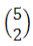
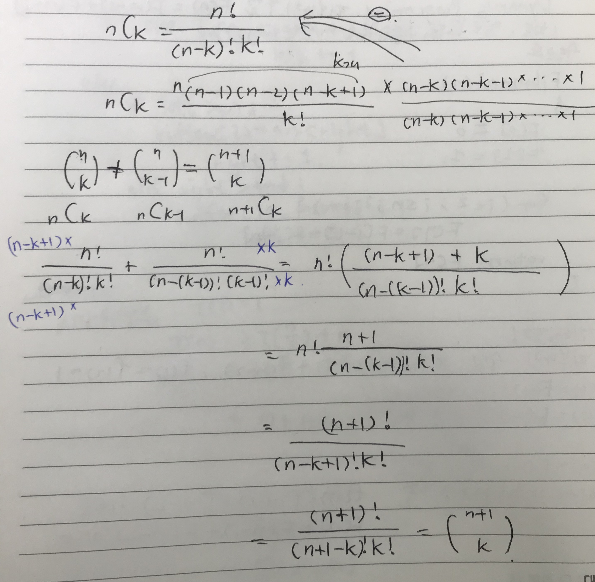
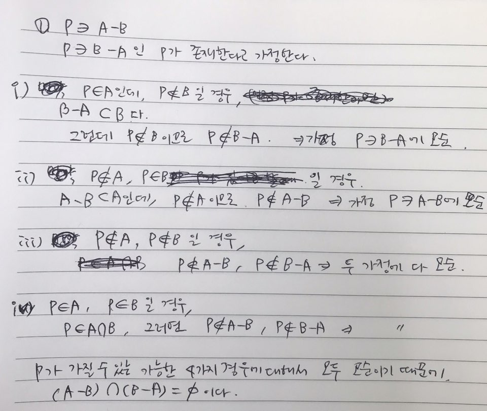
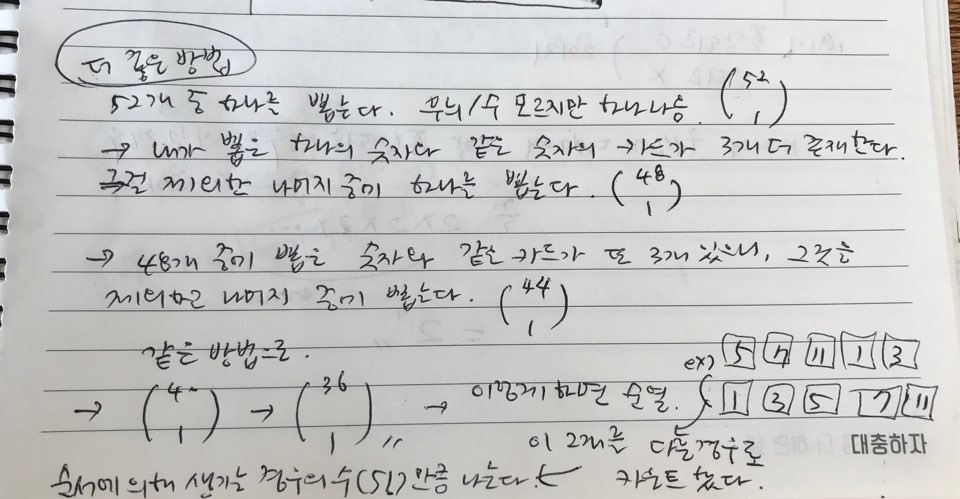
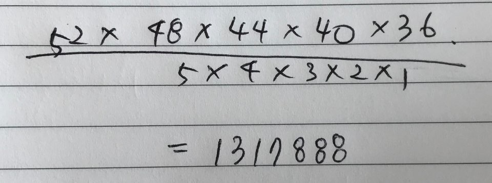

## 집합과 조합론

약간의 설명

두 집합 A와 B에 대해 A가 B의 부분집합임을 증명한다는 것은 A의 임의의 원소가 B에 포함됨을 보이는 것과 같다.

예를 들어 모든 4의 배수는 2의 배수라는 것을 증명하려면, 4k = 2(2k)임을 보이면 되는 것이다.

두집합 A와 B가 같다는 것을 증명하기 위해서는 A가 B의 부분집합이고 B가 A의 부분집합임을 증명하면 된다.

----------

다음 두 집합이 같다는 것을 상세히 증명해보자.

A={x|x=2k+1,k는 정수}, B={x|x=4k+1 혹은 x=4k+3, k는정수}

**A가 B의 부분집합이다: **

A에 포함되는 임의의 원소 x를 가정. 

x=2k+1임. 

k가 짝수(=2t)인 경우와 홀수(=2t+1)인 경우로 나눔. 

짝수인 경우 x = 2k+1 = 2(2t)+1 = 4t+1로서, x는 B에 포함됨.

홀수인 경우 x = 2k+1 = 2(2t+1)+1 = 4t+3로서, x는 B에 포함됨.

모든 가능한 경우에 x는 B에 포함됨.

**B가 A의 부분집합이다:** 

B에 포함되는 임의의 원소 x를 가정.

x = 4k+1인 경우, x = 4k+1 = 2(2k)+1 로서 x는 A에 포함됨.

x = 4k+3인 경우, x = 4k+3 = 2(2k+1)+1로서 x는 A에 포함됨.

모든 가능한 경우에 x는 B에 포함됨.

-위 두가지 증명에 의해서 집합 A와 B는 같다.

-------------

조합론은 경우의 수를 따지는 문제들을 보통 말한다.

조합의 개수는 C(combination)를 이용하여 표현하기도 하지만 =10과 같은 괄호 표현을 더 많이 쓴다.

---------

### 연습문제

#### 문제1

#### 문제2

#### 문제3: 위의 결과를 이용해서 n개의 원소를 가진 집합의 가능한 부분집합의 종류는 `2^n`개 임을 증명하라

#### 문제4

귀류법

어떤 명제를 증명하기 위해서 `그 명제의 부정을 참으로 가정`한다. 그리고 이것이 거짓임을 증명하면 원래의 명제가 참이다.

#### 문제5

#### 문제6

#### 문제7

#### 문제8: 8×8 체스판에 똑같은 말 두 개를 놓으려고 한다. 아무 곳에나 놓아도 되지만 한 칸에 두 개가 들어가지는 못한다. 가능한 방법은 모두 몇 가지인가?

64C2 = 64!/(62!*2!) = 64 * 63 / 2 = 2016 가지

#### 문제9: n개의 원소를 가진 집합의 가능한 부분집합의 종류는 2^n개임을 조합론을 이용해 증명하라.

#### 문제10: 비밀번호를 0부터 9까지의 숫자만 가지고 만든다고 하자. 4개 이상 6개 이하의 숫자를 쓸 수 있다고 할 때 가능한 비밀번호의 가지수는 얼마인가?

#### 문제11: 원소가 m개인 집합에서 원소가 n개인 집합으로 가는 단사함수의 개수는 몇 가지인가?

#### 문제12: 52개의 트럼프 카드 한 세트를 이용해서 만들 수 있는 5개 카드의 조합은 몇 가지인가?

52C5 = 52! / (47! * 5!) = 2598960 가지

#### 문제13: 52개의 카드를 이용해서 만들 수 있는 5개 카드 조합 중 같은 무늬의 카드가 정확히 3개인 경우는 몇 가지인가?

#### 문제14: x+y+z=100의 자연수 해는 몇 가지인가?

#### 문제15: (포함 배제 원리) 5개의 원소를 가진 집합에서 3개의 원소를 가진 집합으로 가는 전사함수는 몇 가지가 있는가?

#### 문제16: 52개 카드에서 5개 카드 조합을 만들 때, 숫자가 같은 카드가 한 쌍도 없는 경우는 몇 가지인가?

#### 더 좋은 풀이법

#### 문제17: n개의 원소를 가진 배열에서 연속된 구간을 잡으려고 한다. 잡을 수 있는 가능한 구간은 몇 가지인가? 단, 구간의 크기는 1 이상이다.