## 집합과 조합론

#### 문제1

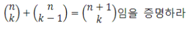

귀류법

어떤 명제를 증명하기 위해서 그 명제의 부정을 참으로 가정한다. 그리고 이것이 거짓임을 증명하면 원래의 명제가 참이다.

#### 문제2

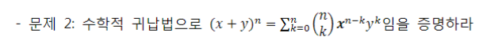

#### 문제3

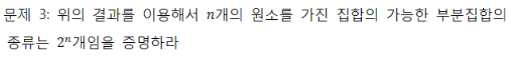

#### 문제4

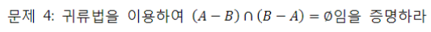

#### 문제5

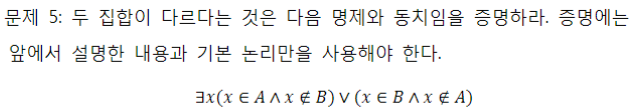

#### 문제6

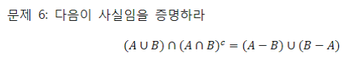

#### 문제7

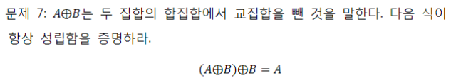

#### 문제8

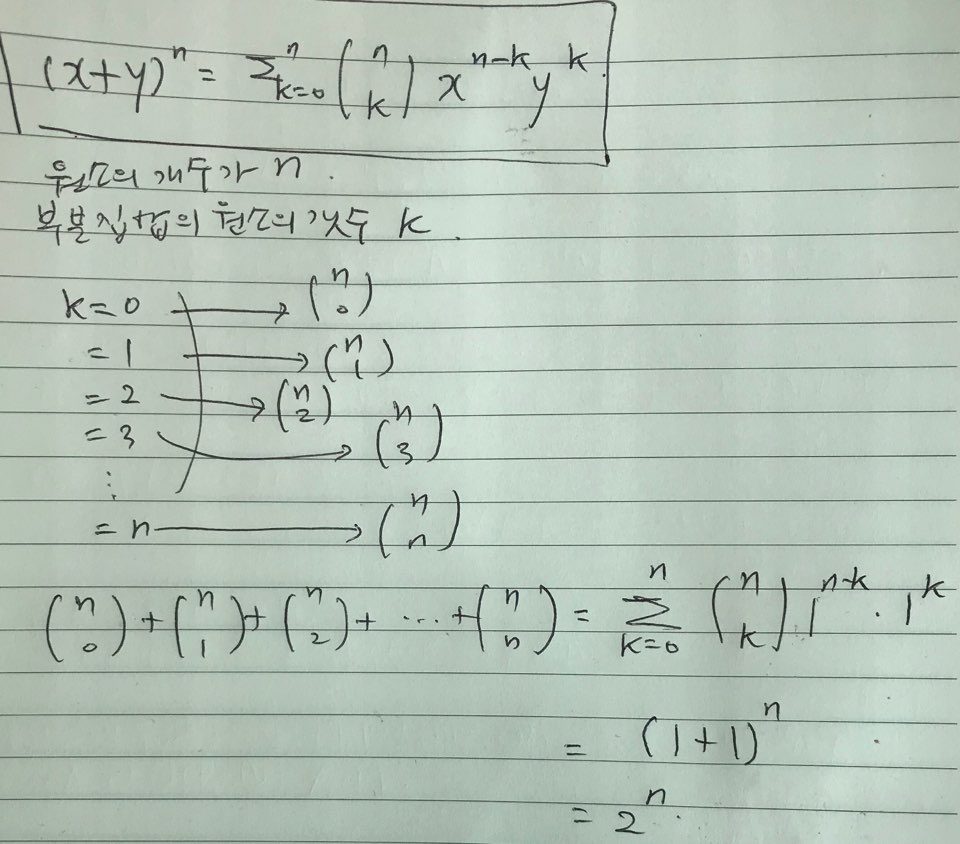

#### 문제9

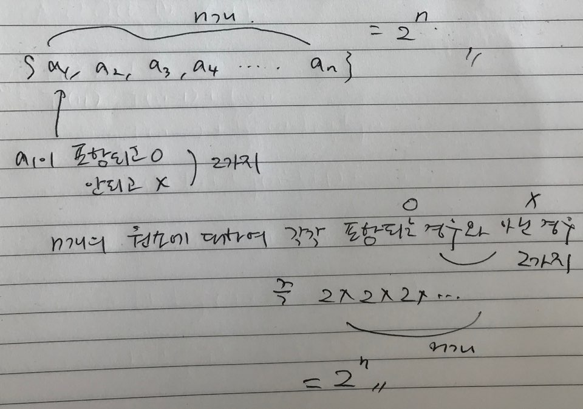

#### 문제10

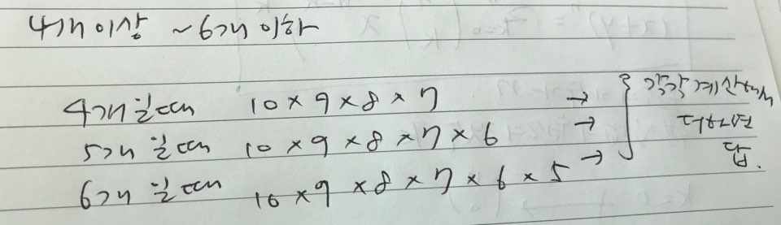

#### 문제11

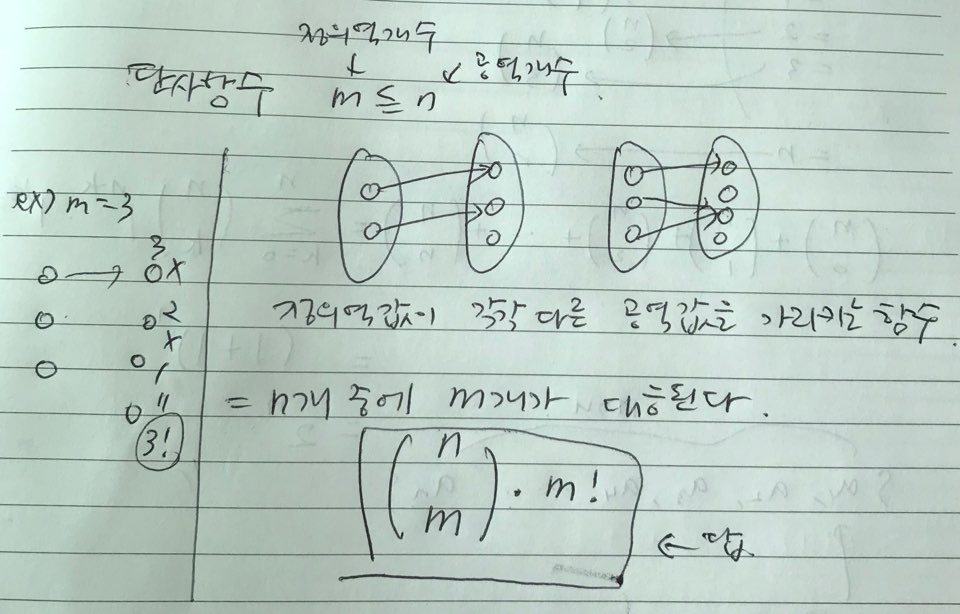

#### 문제12

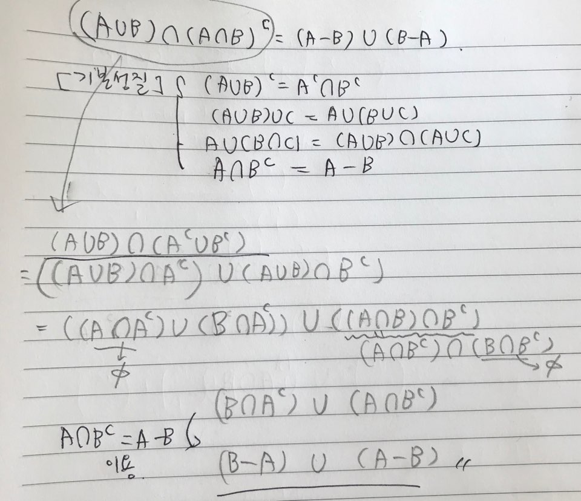

#### 문제13

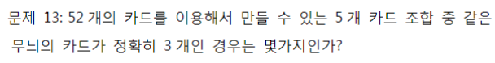

#### 문제14: x+y+z=100의 자연수 해는 몇 가지인가?

#### 문제15: (포함 배제 원리) 5개의 원소를 가진 집합에서 3개의 원소를 가진 집합으로 가는 전사함수는 몇 가지가 있는가?

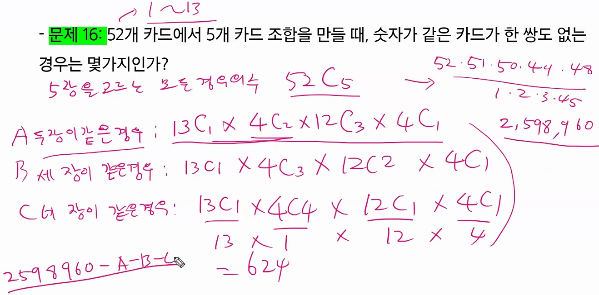

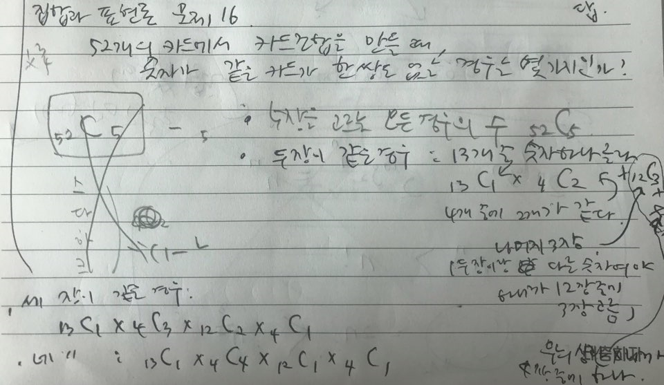

#### 문제17: n개의 원소를 가진 배열에서 연속된 구간을 잡으려고 한다. 잡을 수 있는 가능한 구간은 몇 가지인가? 단, 구간의 크기는 1 이상이다.