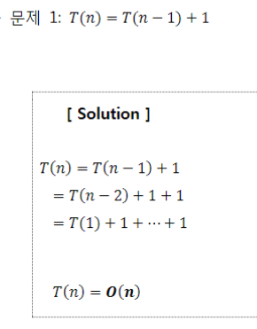
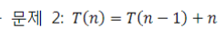
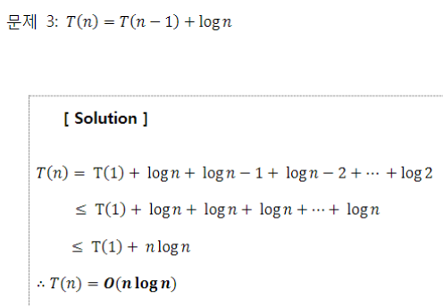
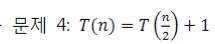
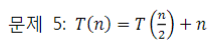
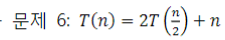
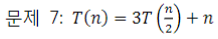
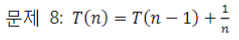
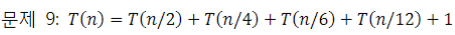
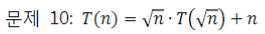

## 기초 수식

#### 약간의 설명

알고리즘의 시간복잡도를 표현할 수 있는 다양한 수식들이 존재한다.

풀이법을 익혀 두어야 알고리즘의 시간복잡도를 계산할 수 있고, 알고리즘이 시간이 얼마나 걸릴지 예측할 수 있다. 

### 연습문제: 다음 재귀식들을 O() notation 수준으로 풀어라. 

#### 문제1

#### 문제2

#### 문제3

#### 문제4

#### 문제5 

#### 문제6

#### 문제7

#### 문제8

#### 문제9

#### 문제10

