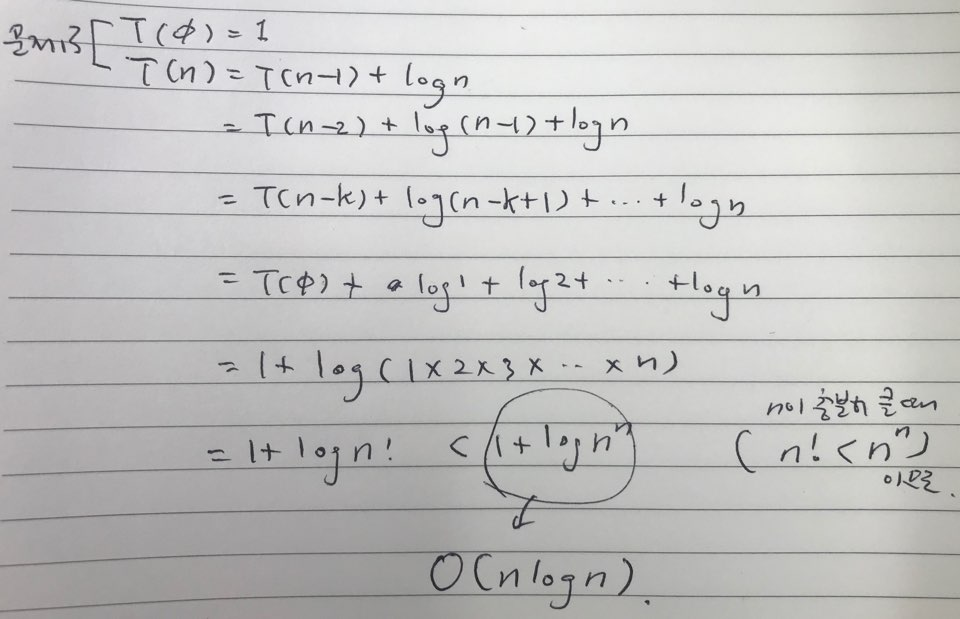
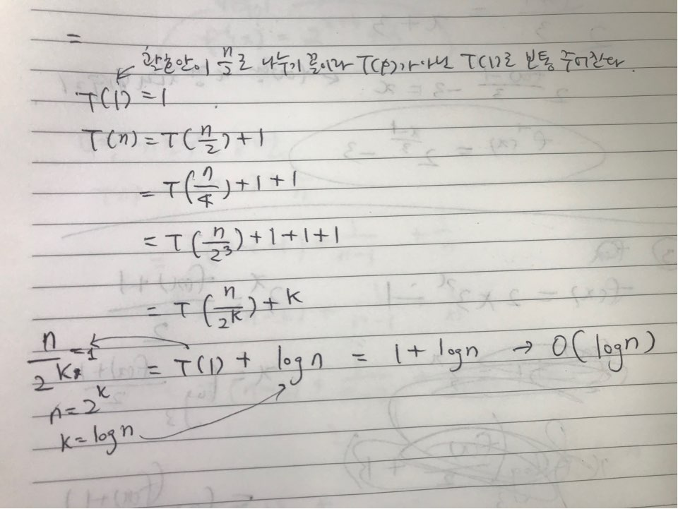
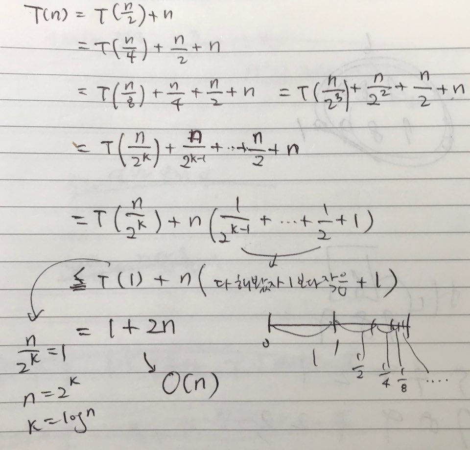

## 기초 수식

#### 약간의 설명

`알고리즘의 시간복잡도`를 표현할 수 있는 다양한 수식들이 존재한다.

풀이법을 익혀 두어야 알고리즘의 시간복잡도를 계산할 수 있고, 알고리즘이 시간이 얼마나 걸릴지 예측할 수 있다. 

### 연습문제: 다음 재귀식들을 O() notation 수준으로 풀어라. 

재귀식은 점화식이 아니다.

무슨 뜻이냐면, T(n) = n개 만큼 들어왔을 때 연산량

T(n) = T(n-1) + 1의 뜻 : n개 만큼 들어왔을 때의 연산량이, n-1개만큼 들어왔을 때의 연산량보다 하나 많다. 

#### 문제1

 

문제 

(n=0일 때) T(0) = 1

(n != 0일 때) T(n) = T(n-1) + 1

 풀이

T(n) = T(n-1) + 1

T(n-2) + 1 +1 

= T(n-k) + k

=T(0) + n

= 1 + n

-> O(n)

#### 문제2

#### 문제3

#### 문제4 

#### 문제5 

#### 문제6

#### 문제7

#### 문제8

#### 문제9

#### 문제10
