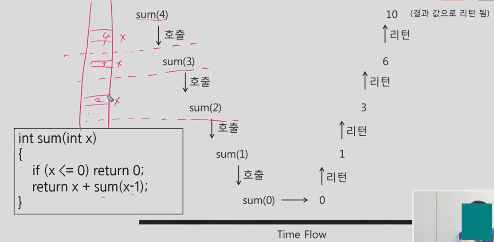
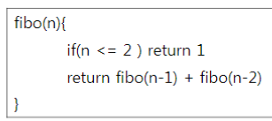
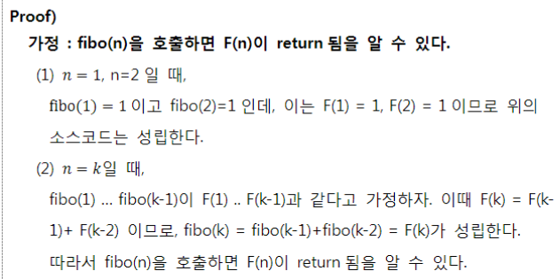
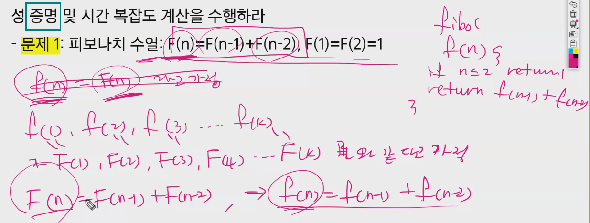
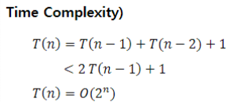
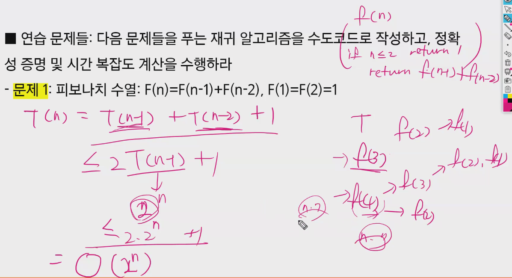
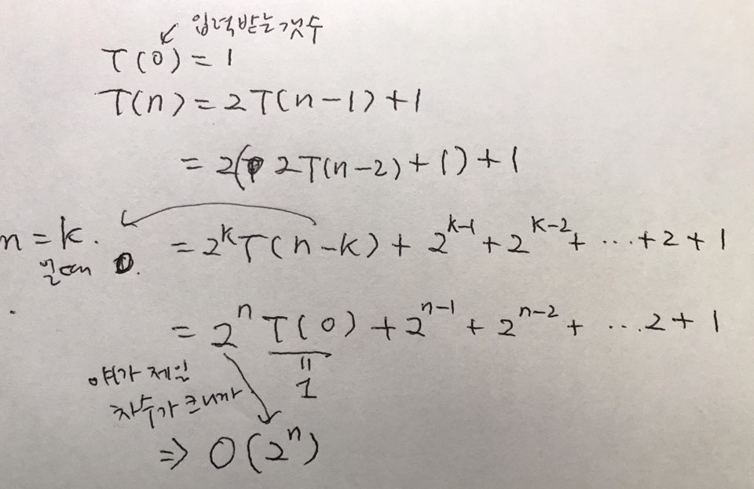

## 재귀


#### 약간의설명

재귀란 자기자신을 호출하는 함수,그럼 끝날 수가 있는가?

함수는 입력이 있으며, 자기자신의 입력과 동일한 입력으로 자기자신을 호출하면 당연히 끝나지않음

하지만, 다른 입력으로 호출하면 끝날 수 있음 

> 일반적인 함수 호출하는 것과 완전히 동일하다.
>
> = 재귀함수를 매번 호출할 때마다 메모리의 각기 다른 부분에 할당된다. 코드 상으로 보기에는 계속 같은 함수 호출하지만, 메모리에 각각 다른 부분에 저장되고 있다. (메모리가 구분되므로 그냥 일반함수 호출과 같다.)

```c++
int abc(int x)     // 이 함수는 안 끝남
{
    return abc(x);
}

int sum(int x)  // 이 함수는 끝남.= 조건을 달았기 때문에 끝남. 결과값은? = 1~x까지의 합
{
    if (x <= 0) return 0;
    return x + sum(x-1);
}
```


함수란 어떤 문제를 해결하는 방법을 코딩한 것

함수가 어떤 문제의 단 한 케이스 만을 해결하는 것이 아님

제대로 코딩된 것이라면 해결하는 문제의 모든 케이스들을 해결해야 함


-수학적 귀납법 증명 사용가능

(가) n이 0일 때 문제를 풀 수 있음

(나) n−1에서 문제를 풀 수 있으면 n에서도 문제를 풀 수 있다

이 두 가지가 사실이면 모든 가능한 n에 대해 문제를 풀 수 있다는 것이 사실


위의 함수 sum()을 보면 정확히 (가), (나) 두 가지를 코딩한 것이다.

> 따라서, sum() 함수는문제를 해결한다는것을증명할 수 있다.
>
> 방금 보인 증명은 high-level 증명이며, 상세한 증명은 과정의 첫 날에 본 것처럼
>
> 0또는 1일 때 가능함을 증명하고, n -> n+1 일 때 가능함을 증명한 것.


재귀를 쓰면 순차적인 것처럼 계산이 다 일어난다. 함수로 만들면서 재귀라는 독특한 형태가 된 거다.

> (교재내용 발췌) 어떤 미스터리한 이유로 문제가 해결되는 것은 아니고, 실제로 프로그램을 돌리면 필요한 계산이 다 일어난다. 순차적인 코드에서 일어나는 계산과 완전히 동일하다. 다만 표현하는 방법이 달라진 것


재귀를 볼 때 loop돌듯이 코드를 따라가는 경향이 있는데 그러지말고

`함수 호출될 때마다 메모리에 어떤 값이 저장이 되는가`를 보자.



지금처럼 단방향이면 한 방향으로,

만약 호출이 갈리면 트리형태로 그리면서 익히자.


어떤 문제를 해결하려다 부분 문제를 만났는데, 원래 해결하려던 입력 케이스와 동일한 문제에 속하지만 "크기가 더 작은” 입력케이스를 해결하는 것이 그 부분문제라면, 재귀를 이용해서 풀 수 있다.

즉, 부분문제가 동일한 문제인 경우!


----------

### 연습문제: 

다음 문제들을 푸는 재귀 알고리즘을 수도코드로 작성하고, 정확성 증명 및 시간복잡도 계산을 수행하라


#### 문제1

수도코드




정확성 증명






시간복잡도








#### 문제2

Merge Sort

크기 n인 배열을 입력으로 받아, 배열을 절반으로 두 개로 나눈 후, 각 작은 배열을 재귀적으로 정렬하고, 그 결과를 Merge한다.

수도코드

정확성증명

시간복잡도

