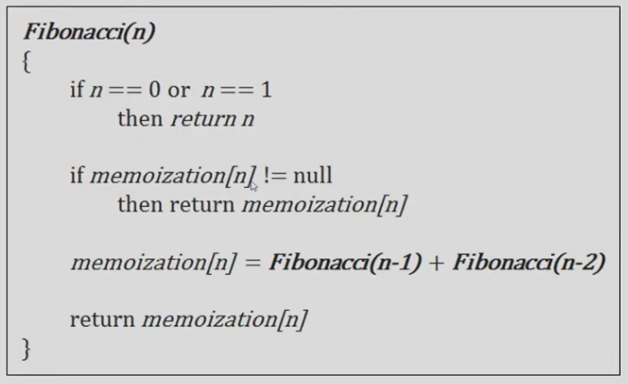
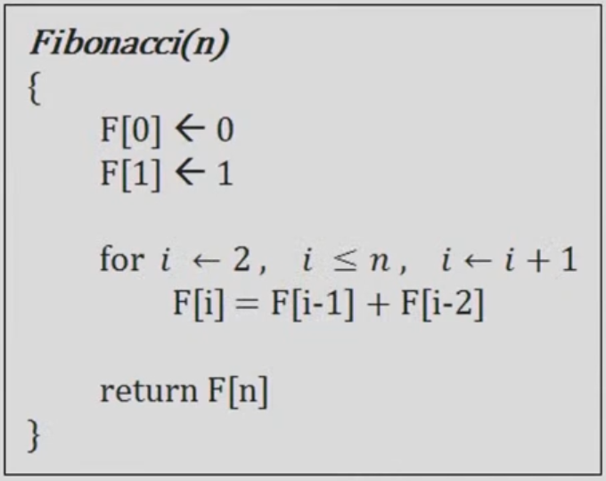
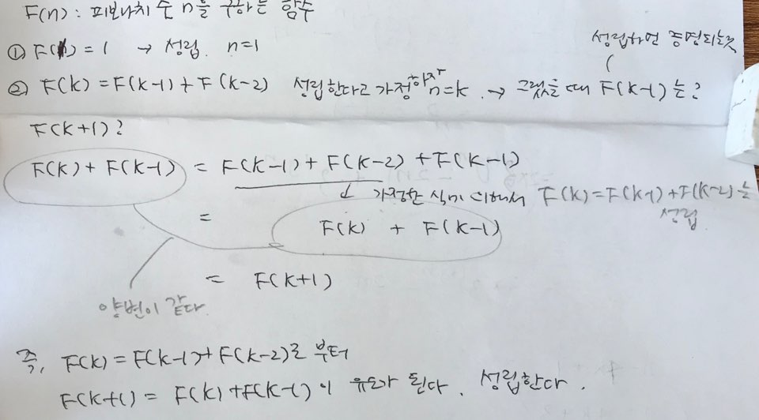
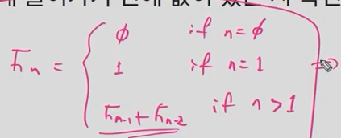

## 동적 프로그래밍

약간의 설명

간단하게 설명하면 재귀 함수에서 동일한 입력의 함수 호출이 반복적으로 일어날 때 그 결과값을 저장해두고 불러쓰는 것이다. (Memoization)

최초 입력에서 파생되는 모든 가능한 입력에 대한 답을 모두 저장할 수 있는 메모리가 있어야 한다.

단순히 재귀에서 저장된 값을 찾아보는 것으로도 가능하지만, 결과값을 순서를 정해서 계산할 수도 있다. (Dynamic Programming)

#### 연습문제

다음 문제들을 푸는 동적 프로그래밍 알고리즘을 수도코드로 작성하고, 정확성 증명및 시간 복잡도 계산을 수행하라

#### 문제1: 

`Memoization` 피보나치수열: -> 재귀형태인데 중간값을 저장한다.  = `하향식 dp`

F(n)=F(n−1)+F(n−2), F(1)=F(2)=1

(힌트: 계산되는 값이 n가지 밖에 없으므로 이 값들을 저장할 수 있는 배열을 만들어 두고 재귀 호출에 들어가기 전에 값이 있는지 확인하는 방법)

#### 문제2: 

`Dynamic Programming` 피보나치수열: -> 반복구조로 만들어서 작은 값부터 순서대로 계산한다. 

F(n)=F(n−1)+F(n−2)

(힌트: 작은값부터순서대로계산한다)

#### 수도코드

#### 수도코드가 유효한지 증명

#### 시간복잡도

O(n)

재귀함수 자체가 호출과 복귀에 시간이 걸리는 함수다. 그러니 굳이 재귀를 쓰지말고 배열을 이용한다. 애초에 작은 값부터 우리가 원하는 값까지 계산하자. = `우리가 흔히 말하는 dp`

ex. 우리가 재귀를 배울 때 많이 나온 팩토리얼도 정작 구현할 때는 dp가 더 good

#### 질문: 실제로 실행시키면 세 버전 중 어느 것이 가장 빠를 것으로 예상되는가? `마지막 것`

`+` dp에서 점화식만 잘 정리해도 쉽게 코드로 옮겨진다.

