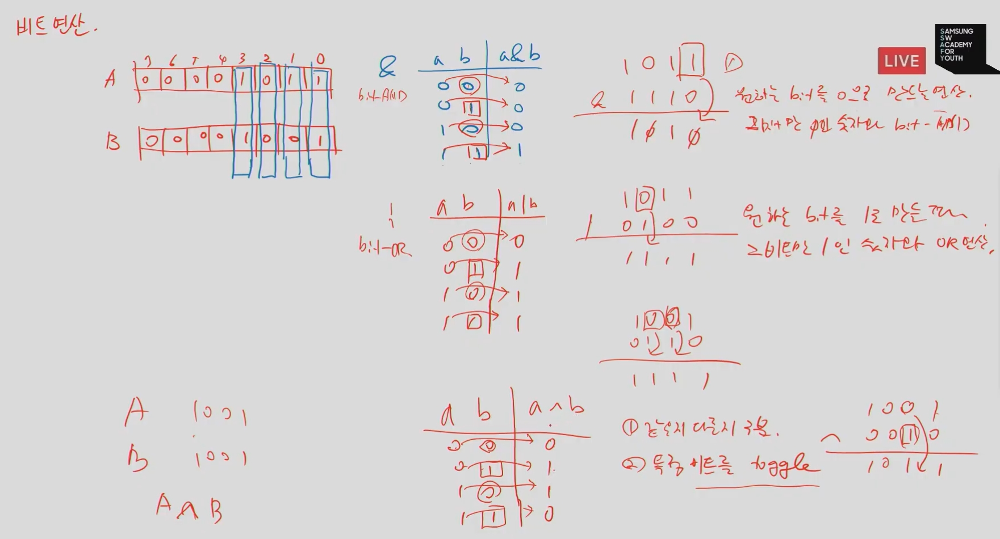

## 비트연산


특정 자리수만 1인 비트 만들기 (`1<<n`)

특정 자리수만 0인 비트 만들기 `~(1<<n)`

> 활용
>
> 1011에서 뒤에서 두 번째 1 하나만 0으로 바꾸고 싶을 때
>
> 1101과 &연산을 하면 된다.
>
> 그럼 1101은 어떻게 만들지? = 0010(`1<<n`) 만들고 단항연산(`~` = 모든 비트를 반전시킴) 한다.


#### 비트연산자

`&` AND 연산

`|` OR 연산

`^` XOR 연산(같으면 0, 다르면 1)

`~` 단항연산자(모든 비트를 반전시킨다. = 토글)

`<<` 쉬프트 연산

`>>` 쉬프트 연산




### 1<<n

> 원소가 n개일 경우의 모든 부분집합의 수를 의미 
>
> `2^n`의 값을 갖는다.
>
> Power set(모든 부분 집합) : 공집합과 자기 자신을 포함한 모든 부분집합
>
> > 각 원소가 포함되거나 포함되지 않는 2가지 경우의 수를 계산하면 모든 부분집합의 수가 된다.


### i & (1>>j)

> 계산 결과는 i의 j번째 비트가 1인지 아닌지를 의미한다.


-------------


### 연습문제

0와 1로 이루어진 1차 배열에서 7개 bit를 묶어서 10진수로 출력하기

예를 들어

00000010001101이면

1, 13 을 출력한다.

```python

```

