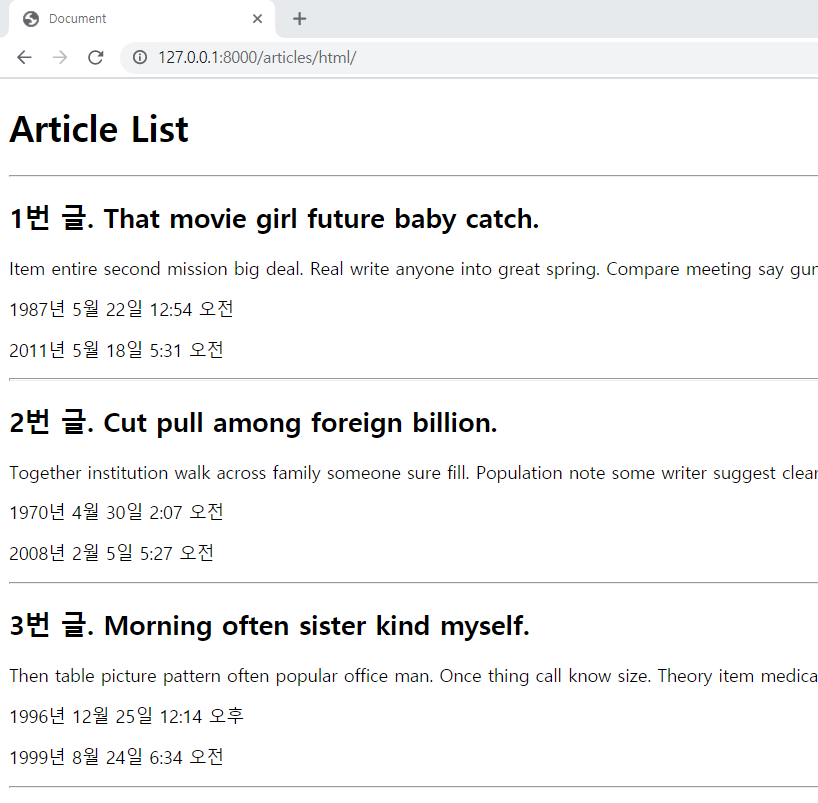
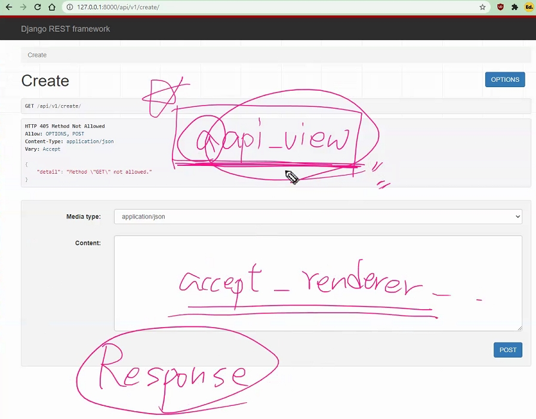

https://github.com/Brobin/django-seed


 faker 더미데이터를 만들어주는 애

*Django-seed* uses the [faker](https://www.github.com/joke2k/faker/) library to generate test data for your Django models.


pip install django-seed (Faker 기반이라 Faker도 같이 설치됨)

settings.py에 INSTALLED_APPS에 등록하기

'django_seed',


$ python manage.py seed articles --number=20
Seeding 20 Articles
Model Article generated record with primary key 1
Model Article generated record with primary key 2
Model Article generated record with primary key 3
Model Article generated record with primary key 4
Model Article generated record with primary key 5
Model Article generated record with primary key 6
Model Article generated record with primary key 7
Model Article generated record with primary key 8
Model Article generated record with primary key 9
Model Article generated record with primary key 10





JSON 공식 인터넷 미디어 타입은 aplication/json이다. 


https://docs.djangoproject.com/en/3.1/ref/request-response/


## `JsonResponse` objects

An [`HttpResponse`](https://docs.djangoproject.com/en/3.1/ref/request-response/#django.http.HttpResponse) subclass that helps to create a JSON-encoded response. 

Its default `Content-Type` header is set to *application/json*.

json으로 응답을 도와주는 친구

(http에서 render하는거랑 동일)


non-dictionary objects 넣을 경우에, safe=False 파라미터를 넣어라.


구글링 django core serializer

https://docs.djangoproject.com/en/3.1/topics/serialization/

Django’s serialization framework provides a mechanism for “translating"

쿼리셋이나 오브젝트(model instance 등)같은 파이썬의 모델타입들을 다른 포맷으로 만든다.


```
from django.core import serializers
data = serializers.serialize("xml", SomeModel.objects.all())
```


-----


## `HttpResponse` objects

https://docs.djangoproject.com/en/3.1/ref/request-response/#django.http.HttpResponse

In contrast to [`HttpRequest`](https://docs.djangoproject.com/en/3.1/ref/request-response/#django.http.HttpRequest) objects, which are created automatically by Django

우리가 무의식적으로 쓰는 request가  HttpResponse의 인스턴스


[`HttpResponse`](https://docs.djangoproject.com/en/3.1/ref/request-response/#django.http.HttpResponse) objects are your responsibility. 

서버가 요청을 받고 **그 응답을 뭘로 할건지(아래 굵은 글씨처럼)**는 개발자 너가 정해(그동안은 render, redirect 등)

*eturn* HttpResponse(data, **content_type='application/json')**


---


### drf (django-rest-framework)

drf라는 프레임워크를 통해서 조작한 다음에 만들어서 json을 응답해줄거다.

https://www.django-rest-framework.org/

- [Serialization](https://www.django-rest-framework.org/api-guide/serializers/) that supports both [ORM](https://www.django-rest-framework.org/api-guide/serializers#modelserializer) and [non-ORM](https://www.django-rest-framework.org/api-guide/serializers#serializers) data sources.


설치하기

```
pip install djangorestframework #다 소문자, 띄어쓰기 없음
```

앱등록하기

```
INSTALLED_APPS = [
    ...
    'rest_framework',
]
```


------


사용하기

https://www.django-rest-framework.org/api-guide/serializers/

Serializers allow complex data such as querysets and model instances to be converted to native Python datatypes that can then be easily rendered into `JSON`, `XML` or other content types.

The serializers in REST framework work very similarly to Django's `Form` and `ModelForm` classes.


ModelSerializer

https://www.django-rest-framework.org/api-guide/serializers/#modelserializer

**The `ModelSerializer` class is the same as a regular `Serializer` class, except that**:

- It will automatically generate a set of fields for you, based on the model.
- It will automatically generate validators for the serializer, such as unique_together validators.


https://github.com/encode/django-rest-framework/blob/master/rest_framework/serializers.py

```python
class ModelSerializer(Serializer):
    """
    A `ModelSerializer` is just a regular `Serializer`, except that:

    The process of automatically determining a set of serializer fields
    based on the model fields is reasonably complex, but you almost certainly
    don't need to dig into the implementation.
    #자동적으로 만들어주지만 내부 구현이 너무 복잡하니까, 너무 실행과정을 파지 않았으면 좋겠다.
    # 내부 구현과정까지 너무 궁금해할 필요가 없다. 프레임워크니까 사용법(=REATful하게 json을 응답하는 서버를 만드는 일)에 집중해라. 
```


Creating responses

https://www.django-rest-framework.org/api-guide/responses/


@api_view()

https://www.django-rest-framework.org/api-guide/views/#api_view

```
from rest_framework.decorators import api_view
```


___


python manage.py shell_plus


```
>>> from articles.serializers import AricleSerializer

>>> ArticleSerializer()
ArticleSerializer():
    id = IntegerField(label='ID', read_only=True)
    title = CharField(max_length=100)
    
>>> article = Article.objects.get(pk=1) 
>>> article
<Article: Article object (1)>

```


```
>>> serializer = ArticleSerializer(article)
>>> serializer
ArticleSerializer(<Article: Article object (1)>):
    id = IntegerField(label='ID', read_only=True)
    title = CharField(max_length=100)
>>> serializer.data
{'id': 1, 'title': 'Hospital full every in finish than.'}
```


```
>>> articles = Article.objects.all()
>>> articles
<QuerySet [<Article: Article object (1)>, <Article: Article object (2)>, <Article: Article object (3)>, <Article: Article object (4)>, <Article: Article object (5)>, <Article: Article object (6)>, <Article: Article object (7)>, <Article: Article object (8)>, <Article: Article object (9)>, <Article: Article object (10)>, <Article: Article object (11)>, <Article: Article object (12)>, <Article: Article object (13)>, <Article: Article object (14)>, <Article: Article object (15)>, <Article: Article object (16)>, <Article: Article object (17)>, <Article: Article object (18)>, <Article: Article object (19)>, <Article: Article object (20)>]>
```


쿼리셋이라서 오류 발생

그래서, 직렬화(=JSON으로 바꾸는 과정)에서는 딕셔너리 비슷한 이 구조가 아니면 다른 조치를 취해줘야한다.

DRF에서는, many=True 쓴다. =  단일객체가 아니라 여러개의 객체를 시리얼라이징할 때 사용

```
>>> serializer = ArticleSerializer(articles)
>>> serializer.data
Traceback (most recent call last):
  File "C:\Users\82107\Desktop\web_django\201005\01_api_project\venv\lib\site-packages\rest_framework\fields.py", line 457, in get_attribute
    return get_attribute(instance, self.source_attrs)
  File "C:\Users\82107\Desktop\web_django\201005\01_api_project\venv\lib\site-packages\rest_framework\fields.py", line 97, in get_attribute
    instance = getattr(instance, attr)
AttributeError: 'QuerySet' object has no attribute 'title'

During handling of the above exception, another exception occurred:

Traceback (most recent call last):
  File "<console>", line 1, in <module>
  File "C:\Users\82107\Desktop\web_django\201005\01_api_project\venv\lib\site-packages\rest_framework\serializers.py", line 548, in data
    ret = super().data
  File "C:\Users\82107\Desktop\web_django\201005\01_api_project\venv\lib\site-packages\rest_framework\serializers.py", line 246, in data
    self._data = self.to_representation(self.instance)
  File "C:\Users\82107\Desktop\web_django\201005\01_api_project\venv\lib\site-packages\rest_framework\serializers.py", line 502, in to_representation
    attribute = field.get_attribute(instance)
  File "C:\Users\82107\Desktop\web_django\201005\01_api_project\venv\lib\site-packages\rest_framework\fields.py", line 490, in get_attribute
    raise type(exc)(msg)
AttributeError: Got AttributeError when attempting to get a value for field `title` on serializer `ArticleSerializer`.
The serializer field might be named incorrectly and not match any attribute or key on the `QuerySet` instance.
Original exception text was: 'QuerySet' object has no attribute 'title'.
```


에러가 안나고 어떠한 형태로 변환이 됐구나!

```
>>> serializer = ArticleSerializer(articles, many=True)
>>> serializer.data
[OrderedDict([('id', 1), ('title', 'Hospital full every in finish than.')]), OrderedDict([('id', 2), ('title', 'Save team marriage can.')]), OrderedDict([('id', 3), ('title', 'Card sort consumer five weight.')]), OrderedDict([('id', 4), ('title', 'Play international book choose.')]), OrderedDict([('id', 5), ('title', 'Third leg beat.')]), OrderedDict([('id', 6), ('title', 'You meeting election amount show letter organization.')]), OrderedDict([('id', 7), ('title', 'Like break special record organization data tough law.')]), OrderedDict([('id', 8), ('title', 'Protect fact accept whole which green alone.')]), OrderedDict([('id', 9), ('title', 'Gas provide challenge need from.')]), OrderedDict([('id', 10), ('title', 'Cut several partner security cultural fly mention lawyer.')]), OrderedDict([('id', 11), ('title', 'Watch body challenge write professional personal far I.')]), OrderedDict([('id', 12), ('title', 'Information country trip sister.')]), OrderedDict([('id', 13), ('title', 'Event beat information.')]), OrderedDict([('id', 14), ('title', 'Theory fear key commercial here.')]), OrderedDict([('id', 15), ('title', 'Believe suggest much agree.')]), OrderedDict([('id', 16), ('title', 'Free left enough talk behind least itself.')]), OrderedDict([('id', 17), ('title', 'Agreement method blood whom step me.')]), OrderedDict([('id', 18), ('title', 'Score fire who law.')]), OrderedDict([('id', 19), ('title', 'Both deep understand drug.')]), OrderedDict([('id', 20), ('title', 'More hold though return order.')])]
>>> 

```


postman

api 서버 개발 총체적 지원


구글링 django rest framework raise exception

https://www.django-rest-framework.org/api-guide/exceptions/

ValidationError

By default this exception results in a response with the HTTP status code "400 Bad Request".


구글링 http status code

https://developer.mozilla.org/ko/docs/Web/HTTP/Status


구글링 django rest framework status code

https://www.django-rest-framework.org/api-guide/status-codes/

```
 return Response(content, status=status.HTTP_404_NOT_FOUND)
```

*return* Response(serializer.data, status=status.HTTP_201_CREATED)


구글링 django httprequest

https://docs.djangoproject.com/en/3.1/ref/request-response/

**HttpRequest.method**


Specifying read only fields

https://www.django-rest-framework.org/api-guide/serializers/#specifying-read-only-fields

read_only를 지정하면 일반적인 vaildation check를 하지 않는다.

어떤 필드에 editable=False나 AutoField로 지정된 것들은 디폴트값으로 read-only가 설정이 된다.

fields = ['id', 'content', 'article',] 에서 id는 AutoField라서, 디폴트로 지정되어 있기 때문에 특별히 id를 입력하지 않아도(넘기지 않아도)  에러가 안 난 것.

'id', models.AutoField(auto_created=True, primary_key=True, serialize=False, verbose_name='ID')),


댓글달 때 article도 read_only 필드로 설정을 해주자

read_only_fields = ['article',]


-----


### REST의 구성 요소

자원   URI + 계층

행위   HTTP Method(GET/POST/PUT/DELETE)      

표현   JSON


2가지 중심 규칙

1. URI -> 자원 표현
2. HTTP Method -> ex. GET /articles/1/


----


#### CRUD

C: post

R: list, detail

U: post + instance

D: instance 받아와서, delete()


---


#### serializer 사용법

Form과 유사

return은 render나 redirect가 아닌 Responce

차이점은 @api_view가 필수

> 입력창은 브라우저에서 알아서 보여주고 우리는 값만 받는다. 
>
> 그냥 처음에 웹페이지 접속하거나, postman에서 요청했을 때 나오는 화면은 다 api_view가 만들어 낸 것.
>
> 만약 @api_view를 적지 않으면 accept_renderer .... 오류가 발생한다.
>
> Reponse 해서 보여줄 템플릿이 있어야 하는데 없어서 나는 오류임.




-----


입력 데이터폼은 Front end가 맡고,

Back end는 DB 업데이트하고 결과를 return


----


### 개발팁

POST/PUT/DELETE는 DB를 직접 건드린다. 

if request.method == "POST"로 적고 else로 GET을 적자.

만약 GET. 이렇게 조금 이상한 요청이 들어왔을 때 if request.method == "GET"였으면, DB를 직접 건드리는 else문이 동작한다. 이런 위험 방지 !

------


돌발퀴즈(review)

```python
class Article(models.Model):
    ...
    like_users = models.ManyToManyField(settings.AUTH_USER_MODEL, related_name="like_articles")
```


위와 같이 모델이 정의되어 있을 때, user가 특정 article에 좋아요를 눌렀는지 아닌지를 판별하는 코드다. 

lf article.like_users.filter(pk=user.pk).exists()


