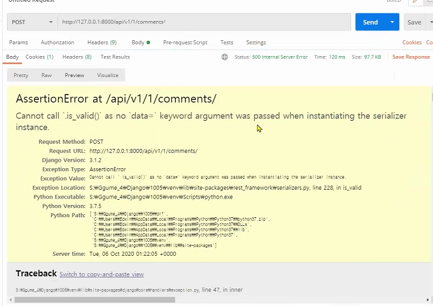

### DRF

* REST
* URI + HTTP method => JSONㄴ
* URI: 자원정보
* HTTP method: 행위 정보
* JSON
  * 문자열
  * 키 - 벨류


* Django REST Framework
  * Serialization: 데이터 구조를 다른 플랫폼에서 활용하고 다시 재구성 가능한 포맷으로 변환하는 과정.


#### model에서 fields를 적을 때

`fields = ('id',)` 이렇게 뒤에 ,를 꼭 찍어야한다. 그렇지 않으면 튜플로 인식안하고 우선순위로 인식함.

그래서 콤마찍는 습관을 들이거나, 안전하게 리스트를 쓰자.

`fields = ['id']` `fields = ['id',]` 둘다 ㅇㅋ


-----


HTTP에서는 request.PUT  request.POST  request.FILES 같이 각각 형식대로 지정해야되지만,

JSON(DRF)에서는 request.data로, **파일이던, 비파일이던 유연하게 한 방에** 사용이 가능하다.


-------


`data = request.data `

여기서 data 빼먹으면 오류난다.

유효성을 저장하기 때문!


오류 메세지




----------


serializers.py에 

`fields = '__all__'`

로 하고서 comment_set를 하나 더 추가할 때

전체 필드를 각각 수동으로 적어줘야한다.

`fields = ['id', 'title', 'content', 'created_at', 'updated_at', 'comment_set',]`


`'__all__'+'comment_set'`이렇게 하면 안된다.

`'__all__'`만 적었을 때는, 장고가 아! 모든 정보구나 하고 인식을 한다. 

그런데 `'__all__'+'comment_set'`로 하면

문자열 + 문자열이 되서, 

`'__all__comment_set'`로 인식 

오잉?


-------

#### serializer 구현 순서

JSON

1. DB에서 data 가져오기
2. serializer로 data 직렬화
3. Response
4. @api_view 붙이기


-------

#### violate DRY

DRY 위배 - 소프트웨어 개발 3개 원칙 중 하나

Do not Repeat Yourself

여기서(DRF)는, 오버라이딩할 때 read_only=True를 적었는데 Meta 클래스에 read_only_field를 또 적은 것을 말한다. 


----------

### DRF-YASG

https://github.com/axnsan12/drf-yasg

STABLE한 REST FRAMEWORK 버전으로 먼저 맞추고 yasg를 install하자.

pip uninstal djangorestframework

pip install djangorestframework=3.11

이렇게 하면 3.11중에 제일 최신으로 설치된다.

```bash
pip install -U drf-yasg
```


앱등록

```python
INSTALLED_APPS = [
   ...
   'drf_yasg',
```


그리고 urls.py에 설정

```python
from django.contrib import admin
from django.urls import path, include, re_path


from rest_framework import permissions
from drf_yasg.views import get_schema_view
from drf_yasg import openapi

schema_view = get_schema_view(
   openapi.Info(
      title="Snippets API",
      default_version='v1',
      description="Test description",
      terms_of_service="https://www.google.com/policies/terms/",
      contact=openapi.Contact(email="contact@snippets.local"),
      license=openapi.License(name="BSD License"),
   ),
   public=True,
   permission_classes=(permissions.AllowAny,),
)

urlpatterns = [
    path('admin/', admin.site.urls),
    path('api/v1/', include('music.urls')),
    
    re_path(r'^swagger(?P<format>\.json|\.yaml)$', schema_view.without_ui(cache_timeout=0), name='schema-json'),
    path('swagger/', schema_view.with_ui('swagger', cache_timeout=0), name='schema-swagger-ui'),
    path('redoc/', schema_view.with_ui('redoc', cache_timeout=0), name='schema-redoc'),
]

```


서버키고 

- A JSON view of your API specification at `/swagger.json`
- A YAML view of your API specification at `/swagger.yaml`
- A swagger-ui view of your API specification at `/swagger/`
- A ReDoc view of your API specification at `/redoc/`


https://drf-yasg.readthedocs.io/en/stable/