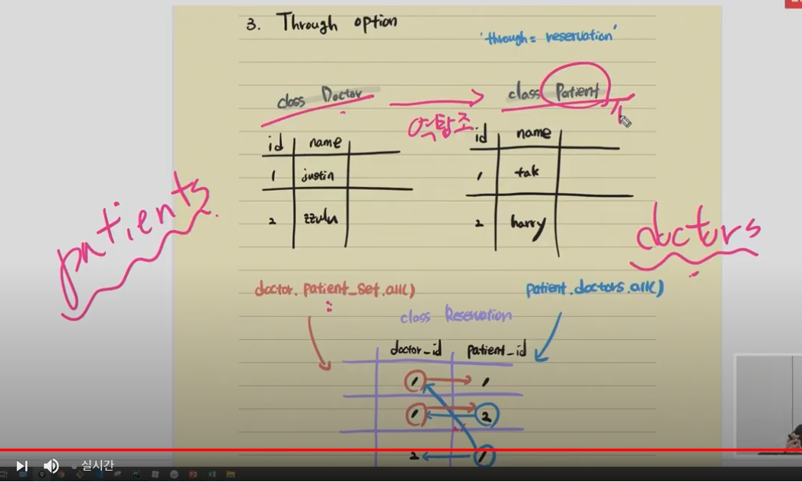

```python
#accounts/models.py

from django.db import models
from django.contrib.auth.models import AbstractUser

# Create your models here.
class User(AbstractUser):
    # 유저 간에 M:N관계로 설정할때 자기가 팔로우 하는 유저의 필드명을 followings로 하고 자신을 팔로우하는 유저(역참조)를 followers로 설정
    followings = models.ManyToManyField('self', symmetrical=False, related_name='followers')
```


```python
#articles/models.py

from django.db import models
from django.conf import settings

# Create your models here.
class Article(models.Model):
    user = models.ForeignKey(settings.AUTH_USER_MODEL, on_delete=models.CASCADE)
    like_users = models.ManyToManyField(settings.AUTH_USER_MODEL, related_name='like_articles')
    title = models.CharField(max_length=10)
    content = models.TextField()
    created_at = models.DateTimeField(auto_now_add=True)
    updated_at = models.DateTimeField(auto_now=True)
    
    def __str__(self):
        return self.title


class Comment(models.Model):
    article = models.ForeignKey(Article, on_delete=models.CASCADE)
    user = models.ForeignKey(settings.AUTH_USER_MODEL, on_delete=models.CASCADE)
    content = models.CharField(max_length=200)
    created_at = models.DateTimeField(auto_now_add=True)
    updated_at = models.DateTimeField(auto_now=True)

    def __str__(self):
        return self.content

```


```bash


reservation1 = Reservation.objects.create(doctor=doctor1, patient=patient1)


reservation1

<Reservation: 1번 의사의 1번 환자>


doctor1.reservation_set.all()

<QuerySet [<Reservation: 1번 의사의 1번 환자>]>


patient1.reservation_set.all()

<QuerySet [<Reservation: 1번 의사의 1번 환자>]>


patient2 = Patient.objects.create(name='harry')


reservation2 = Reservation.objects.create(doctor=doctor1, patient=patient2)


reservation2

<Reservation: 1번 의사의 2번 환자>


doctor1.reservation_set.all()

<QuerySet [<Reservation: 1번 의사의 1번 환자>, <Reservation: 1번 의사의 2번 환자>]>


patient2.reservation_set.all()

<QuerySet [<Reseravtion: 1번 의사의 2번 환자>]>
```


```bash
patient1 = Patient.objects.get(pk=1)


patient1

<Patient: 1번 환자 tony>


patient1.reservation_set.all()

<QuerySet [<Reservation: 1번 의사의 1번 환자>]>


patient1.doctors.all()

<QuerySet [<Doctor: 1번 의사 justin>]>


doctor2 = Doctor.objects.create(name='eric')


Reservation.objects.create(doctor=doctor2, patient=patient1)

<Reservation: 2번 의사의 1번 환자>


doctor1 = Doctor.objects.get(pk=1)

doctor1.patient_set.all()

AttributeError: 'Doctor' object has no attribute 'patient_set'


doctor1.patients.all()

<QuerySet [<Patient: 1번 환자 tony>, <Patient: 2번 환자 harry>]>


```


```
# related name이 필요한 이유
# 1 : N
article => user / article.user
user => article / user.article_set--유저가 작성한 게시글들


# M: N
article => user / article.users
user => article / user.article_set--유저가 좋아요한 게시글들
```





```python
from django.db import models

class Doctor(models.Model):
    name = models.TextField()
    
    def __str__(self):
        return f'{self.pk}번 의사 {self.name}'

    
class Patient(models.Model):
    name = models.TextField()
    #doctor = models.ForeignKey(Doctor, on_delete=models.CASCADE)
    
    # ManyToManyField = related_name 작성
    doctors = models.ManyToManyField(Doctor, through='Reservation', related_name='patients')
    
    # through option 삭제
    #doctors = models.ManyTOManyField(Doctor, related_name='patients')
    
    def __str__(self):
        return f'{self.pk}번 환자 {self.name}'
    
    
class Reservation(models.Model):
    doctor = models.ForeignKey(Doctor, on_delete=models.CASCADE)
    patient = models.ForeignKey(Patient, on_delete=models.CASCADE)
    
    def __str__(self):
        #return f'{self.doctor.pk}번 의사의 {self.patient.pk}번 환자'
        return f'{self.doctor_id}번 의사의 {self.patient_id}번 환자'

```

