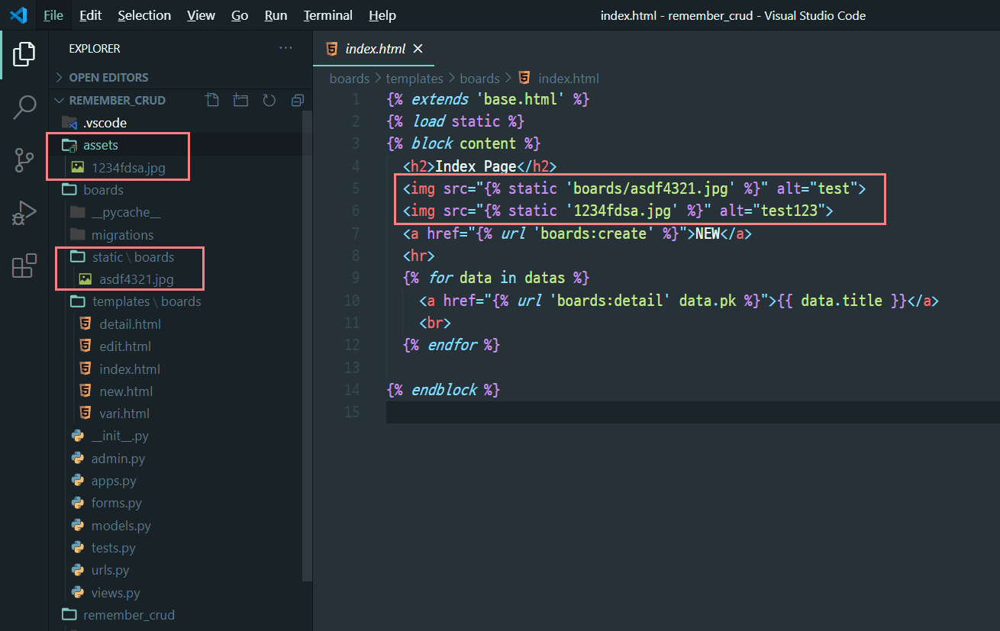

(함께 연습한 코드 - 내 github https://github.com/EunjiYi/framework/tree/master/201201_remember_static_media/remember_crud)


### static

in settings.py

static url ->  스태틱파일로 접근할 수 있는 경로

static root -> 배포시 모든 이미지를 한군데에 모아줌

staticfiles_dirs -> 특정 앱이 아닌 전체 지정이 필요할 때.

```python
STATIC_URL = '/static/'
STATIC_ROOT = BASE_DIR / 'static_files'
STATICFILES_DIRS = [BASE_DIR / 'assets']
```




그리고 index.html 에서 ``해주면 끝.

위치는 `` 밑에 적는다. block은 content부분을 원하는 대로 이름 지정할 수 있지만 static은 정확히 load static이라고 적어야한다.

 `` -> 특정 앱(boards)

`  ` -> 전체 (assets)


-------

-------

### media

1) pip install Pillow 설치


2) models.py에 image를 등록할 수 있는 컬럼 추가하기.

```python
from django.db import models

class Board(models.Model):
    title = models.CharField(max_length=50)
    content = models.TextField()
    created = models.DateTimeField(auto_now_add=True)
    updated = models.DateTimeField(auto_now=True)
    image = models.ImageField(upload_to="%Y/%m/%d/", blank=True, null=True)

    def __str__(self):
        return f'{self.id}: {self.title}'

```


image = models.ImageField(upload_to="%Y/%m/%d/", blank=true, null=true)

blank는 사용자가 이미지를 등록하지 않아도 게시글이 작성될 수 있게 하는 옵션.

null = true는 사용자가 이미지를 등록하지 않았을 때 db에 null이 저장되도록 하는 것. 이 옵션이 없는데, 사용자가 이미지를 등록하지 않고 게시물을 저장하면, db에 `null`이 아닌 `''`로 들어간다.


`+` forms.py

```python
from django import forms
from .models import Board

class BoardForm(forms.ModelForm):
    class Meta:
        model = Board
        fields = "__all__"
```


3) settings.py

```python
MEDIA_URL = '/media/' #사용자가 올린 이미지를 저장하고 있는 가상의 경로
MEDIA_ROOT = BASE_DIR / 'uploaded_files'
```


MEDIA_URL -> 사용자가 올린 이미지에 접근할 수 있는(=볼 수 있는) 가상의 경로.  `` 

사실 이렇게 접근할 일은 없다. 사용자가 무슨 이름으로 올렸을 줄 알고 하드코딩하느냐.

MEDIA_ROOT -> 사용자가 올린 이미지가 저장되는 경로. upload_to를 지정하면 이 폴더 아래에 생긴다. 


사용자가 게시글에서 asdf4321.jpg를 올렸을 때 이곳에 저장된다.


4) views.py

```python
def create(request):
    if request.method == "POST":
        form = BoardForm(request.POST, request.FILES)
        if form.is_valid:
            board = form.save()
            return redirect('boards:detail', board.pk)
    else:
        form = BoardForm()
    context = {
        'form': form,
    }
    return render(request, 'boards/new.html', context)
```


form = BoardForm(request.POST, request.FILES) # 이미지를 포함한 모든 form 인스턴스 생성

`request.FILES` 를 넣어준다.


5) new.html

```python


<h2>NEW Page</h2>
<hr>
<form action="" method="POST" enctype="multipart/form-data">
  
  {{ form.as_p }}
  <button>submit</button>
</form>


```


post요청 시 

`<form 속성에 method = "POST"  enctype="mutipart/form-data">`

해준다.


6) 프로젝트 urls.py

```python
from django.contrib import admin
from django.urls import path, include
from django.conf import settings
from django.conf.urls.static import static 

urlpatterns = [
    path('admin/', admin.site.urls),
    path('boards/', include('boards.urls')),    
] + static(settings.MEDIA_URL, document_root=settings.MEDIA_ROOT)
```


from django.conf import settings

from django.conf.urls.static import static 

2개 import 해주고.

`+ static(settings.MEDIA_URL, document_root = settings.MEDIA_ROOT)` 지정


7) detail.html

```python


<h2>Detail Page</h2>
<hr>
<p>{{ data.title }}</p>
<p>{{ data.content }}</p>
<p>{{ data.created }}</p>
<p>{{ data.updated }}</p>


<br>
<a href="">[Edit]</a>
<br>
<form action="" method="POST">
  
  <button>삭제</button>
</form>

```

media를 사용하기 위해 static 처럼 별도의 load를 해야하는 과정은 없다.

``

예시

``


Done.